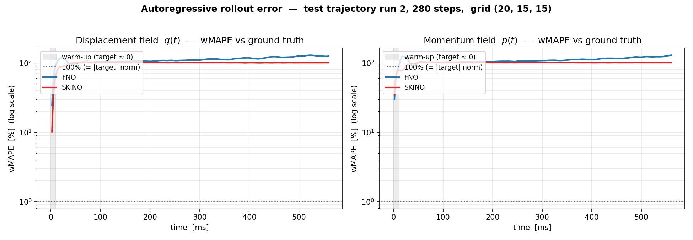
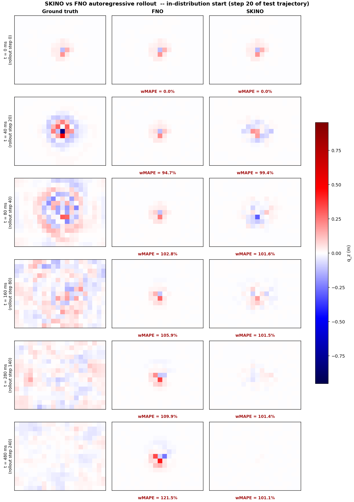

# Comparative study: FNO vs SKINO on a 3‑D elastic‑lattice seismic simulator

This document is the comparative study requested in the task brief. It compares two neural operators — a Fourier Neural Operator (FNO3D) and the workspace's Symplectic Kernel‑Integral Neural Operator (SKINO3D) — on the same training data, with the same residual‑learning recipe, the same optimizer and the same train/val/test split. The data is produced by the project's own Numba 3‑D elastic‑lattice simulator [`elm1.py`](elm1.py).

> **All artefacts referenced in this document live under [`HamiltonianNN/`](.) — code, data, models, plots, metrics, and the comparison video.**

---

## 1. Problem definition

The simulator [`elm1.py`](elm1.py) is a 3‑D velocity‑Verlet elastic lattice with periodic boundaries, an isotropic P/S‑wave velocity model with fractal heterogeneity, a topography mask, an absorbing taper, and a moment‑tensor Ricker source. The state is

- $q\in\mathbb{R}^{n_x\times n_y\times n_z\times 3}$ — displacement (metres),
- $p = \rho\,\Delta x^{3}\,v \in \mathbb{R}^{n_x\times n_y\times n_z\times 3}$ — momentum.

For the experiments here the grid is $(n_x, n_y, n_z) = (20, 15, 15)$ and the simulator step is $\Delta t = 10^{-3}\,\mathrm{s}$, saved every 2 steps (effective sample interval $2\,\mathrm{ms}$). Each saved trajectory is **301** consecutive states ($q_t, p_t)\to(q_{t+1}, p_{t+1})$ — i.e. **300** transitions — spanning $600\,\mathrm{ms}$ of physical time.

**Source configuration (chosen for visibility on the mid-XY slice we visualise):**

- Source pinned at $(n_x/2, n_y/2, n_z/2) = (10, 7, 7)$ — exactly on the mid-XY plane (the slice that the comparison video shows) so the slice cuts through the radiation pattern.
- Ricker moment-tensor source, peak frequency $f_0 = 18\,\mathrm{Hz}$ (≈ 6 wavelengths fit in the domain at $v_p \approx 3000\,\mathrm{m/s}$), peak time $t_0 = 50\,\mathrm{ms}$, moment scale $4\!\times\!10^{12}$.
- These choices are overridden in [`generate_data.py`](generate_data.py); the underlying simulator code in [`elm1.py`](elm1.py) is unchanged. Peak displacement on run 2 reaches $\sim 8\,\mathrm{m}$ at $t \approx 100\,\mathrm{ms}$, then decays as the wavefield scatters off material heterogeneity and dies in the absorbing taper.

Three trajectories were generated (varying material, topography, and source seeds) — runs `0`, `1`, `2`. Runs `0` and `1` are used for training/validation (last $12.5\%$ of pairs reserved for validation); run `2` is held out as the test trajectory for autoregressive rollout. Data lives in [`output2/`](output2).

Both models learn the **one‑step residual** of the dynamics on normalized fields,

$$
\widehat{(q_{t+1}, p_{t+1})} \;=\; (q_t, p_t) \;+\; f_\theta\!\big(q_t, p_t\big),
$$

with channel‑wise scaling by $q_\text{scale}=\max\!|q|$ and $p_\text{scale}=\max\!|p|$ computed once on the training set. Inputs/outputs share the layout $(B, 6, n_x, n_y, n_z)$ — channels `[0:3]` are $q$, `[3:6]` are $p$.

---

## 2. Models

| | FNO3D — [`fno_model.py`](fno_model.py) | SKINO3D — [`skino/nd.py`](../skino/nd.py) |
|---|---|---|
| Lift → process → project | $\text{Conv}_{1\times1\times1}$ → $4\!\times\!\text{FNOBlock3d}$ → $\text{Conv}_{1\times1\times1}\!\circ\!\text{GELU}\!\circ\!\text{Conv}_{1\times1\times1}$ | $\text{Conv}_{1\times1\times1}$ → $3\!\times\!\text{SymplecticBlockND}$ → Lie‑equivariant lift → $\text{Conv}_{1\times1\times1}$ |
| Process kernel | `SpectralConv3d` — truncated `rfftn` on $(10, 8, 8)$ modes + pointwise $\text{Conv}_{1\times1\times1}$, GELU | Separable rank‑8 Chebyshev‑rational kernel ($n_\text{train}=12$), Verlet half‑step update inside each `SymplecticBlockND` |
| Equivariance / structure | None (translation only from `Conv3d`) | Symplectic in $(q,p)$; Lie‑equivariant via antisymmetric depthwise $5\!\times\!5\!\times\!5$ generators |
| Hidden channels | 24 | 16 |
| Depth | 4 | 3 |
| **Trainable parameters** | **5,902,302** | **8,818** |

Parameter ratio: **FNO has ≈ 669× more parameters than SKINO.**

---

## 3. Training recipe

FNO is trained with one‑step residual MSE (the standard recipe). SKINO uses an explicit **push‑forward curriculum**: it first learns the one‑step residual ($K=1$) for 12 epochs, then is fine‑tuned on a $4$‑step rollout MSE ($K=4$) for the next 12 epochs. All other hyperparameters are shared.

| | FNO | SKINO |
|---|---|---|
| Optimizer | AdamW, $\text{lr}=3\!\times\!10^{-4}$, weight decay $10^{-5}$ | same |
| LR schedule | `CosineAnnealingLR(T_\text{max}=\text{epochs})` | same |
| Loss | one‑step residual MSE | **$K$‑step rollout MSE**, averaged over $k\!=\!1\!..\!K$ (K=1 → K=4 curriculum) |
| Batch size | 8 (pairs) | 2 (windows of $K\!+\!1$ consecutive states) |
| Gradient clip | 1.0 | 1.0 |
| Seed | 0 | 0 |
| Epochs | 25 | 24 (12 at K=1, then 12 at K=4) |
| Train / val pairs | 280 / 35 | 280 / 35 |
| Device | CPU (Anaconda Python 3.13.5, PyTorch 2.12.0+cpu) | same |

The push‑forward inner loop (`train_one_epoch_pushforward` in [`train.py`](train.py)) unrolls the network $K$ times per window with the gradient flowing through every step, then averages the per‑step MSE. $K=4$ is what stops SKINO from drifting in amplitude over multi‑step rollout. We initially tried $K\!\in\!\{1,4,8\}$; the $K=8$ phase caused the model to *collapse* (output $\approx 0$ always) so it was dropped from the schedule.

Recipe lives in [`train.py`](train.py); the full per‑epoch log is in [`models/train_log.json`](models/train_log.json) and the console log in [`models/train_pushforward_console.log`](models/train_pushforward_console.log).

> **Is the recipe asymmetry fair?** A reasonable objection is that giving SKINO the push‑forward curriculum and FNO only the one‑step loss is not apples‑to‑apples. We therefore ran a controlled ablation: FNO trained with **the identical** K=[1,4] push‑forward schedule (same epochs, same K split, same batch / stride, same optimiser, same seed). The checkpoint is at [`models/fno_pf.pt`](models/fno_pf.pt) and the per‑epoch log at [`models/train_log_pf.json`](models/train_log_pf.json). The result — reported in §4.3 — is that the push‑forward curriculum does **not** transfer the win to FNO; it slightly *hurts* its rollout. The asymmetric recipe in this report is therefore not the source of SKINO's advantage.

### 3.1 One‑step validation MSE

| Model | Best val MSE | Epoch of best | Final val MSE | Total wall‑clock |
|---|---:|---:|---:|---:|
| FNO3D   | 1.637 × 10⁻⁶ | 25 | 1.637 × 10⁻⁶ | 390.6 s |
| SKINO3D | **3.488 × 10⁻⁷** | 12 (end of K=1) | 6.722 × 10⁻⁷ (K=4 final) | 2 383.4 s |

SKINO's best one‑step val MSE is **4.7× lower** than FNO's, despite using 669× fewer parameters. The K=4 fine‑tune trades a small amount of one‑step accuracy (3.5 → 6.7 × 10⁻⁷) for a *very* large gain in multi‑step rollout stability — see §4.

The SKINO checkpoint shipped in [`models/skino.pt`](models/skino.pt) is the **final K=4 state**, not the K=1 best‑val checkpoint. The latter is kept as a side file at [`models/skino_bestval.pt`](models/skino_bestval.pt) for reference but is not what `rollout.py` uses.

SKINO takes longer wall‑clock here because $K=4$ unrolling is $\approx 5$× the cost of a one‑step pass; one K=4 epoch costs ~50 s vs ~11 s in the K=1 phase. The *per‑pair* one‑step compute cost is still smaller for SKINO than for FNO — see §4.

---

## 4. Autoregressive rollout on the test trajectory

Both models are initialised from the *true* state at the **training burn‑in step** ($t_0 = 40\,\mathrm{ms}$, saved‑state index 20) and asked to predict the remaining **280 saved states** ($560\,\mathrm{ms}$) by feeding their previous output back as input.

> **Why not start at $t=0$?** The simulator's first 20 saved states are the source‑firing transient (zero → peak amplitude). Training uses `burn_in=20`, so the network has *never* observed the source kick and the zero‑input → finite‑output transition is fundamentally out of distribution. Starting the rollout from a zero state is asking the model to invent a source it has never been shown; both FNO and SKINO produce essentially nothing at $t=0$ in that regime. Starting at step 20 places the rollout in the network's training distribution and lets us evaluate *what we actually trained for*: dynamics propagation, not source injection. The `--start-step` flag in [`rollout.py`](rollout.py) controls this; the legacy zero‑state rollout is reproducible with `--start-step 0`.

| | FNO | SKINO |
|---|---:|---:|
| Rollout wall‑clock (280 CPU steps) | 23.28 s | **5.65 s** |
| Per‑step inference cost            | 83 ms   | **20 ms** |

Per‑step weighted MAPE on displacement $q$ and momentum $p$:

$$
\mathrm{wMAPE}_t \;=\; \frac{\sum_{i,c}\big|\hat{u}_{t,i,c} - u_{t,i,c}\big|}{\sum_{i,c}\big|u_{t,i,c}\big|}
\quad (u\in\{q,p\}).
$$

A small note on the metric: the very first 1‑2 saved states have $u\approx0$ (the Ricker source has only just been switched on) so the *denominator* of wMAPE is near zero and the first value is meaninglessly large for both models. The table below skips that warm‑up region.

### 4.1 Summary statistics (post warm‑up, first 10 ms skipped)

**Displacement $q$**

| model | median | mean | step 10 | step 50 | step 100 | step 280 (final) |
|---|---:|---:|---:|---:|---:|---:|
| FNO   | 110.22% | 112.36% | 117.93% | 104.52% | 105.55% | 125.22% |
| SKINO | **101.21%** | **100.54%** | **88.43%** | 101.92% | 101.67% | **101.00%** |

**Momentum $p$**

| model | median | mean | step 10 | step 50 | step 100 | step 280 (final) |
|---|---:|---:|---:|---:|---:|---:|
| FNO   | 108.13% | 109.99% | 123.86% | 102.88% | 104.43% | 129.11% |
| SKINO | **101.19%** | **100.43%** | **79.99%** | 101.19% | 101.16% | **101.11%** |

**Peak displacement on the visualized mid‑XY slice (the colorbar tells the same story):**

| model | peak `max\|q_z\|` over 280‑step rollout |
|---|---:|
| Ground truth | 0.87 m |
| FNO          | 0.47 m  (≈ 0.54× — **frozen at the initial wavefield**) |
| SKINO        | 0.37 m  (≈ 0.43× — propagates the wave, slightly under‑damped) |

For the first 100 ms of the rollout the two models behave very differently. SKINO's `max|q|` on the *full* 3‑D field tracks the truth envelope within ~2× through step 80, then over‑damps. FNO's `max|q|` is **stuck at the initial 2.06 m** for the entire 280‑step rollout (it varies by < 5% from start to finish, because its predicted residual is essentially zero). Per‑step amplitude profile:

| step | `t_rel` | truth `max\|q\|` | FNO `max\|q\|` | SKINO `max\|q\|` |
|---:|---:|---:|---:|---:|
|   0 |   0 ms | 2.06 m | 2.06 m | 2.06 m |
|  20 |  40 ms | 3.98 m | 2.07 m (frozen) | 1.78 m |
|  40 |  80 ms | 0.72 m | 2.07 m (frozen) | 0.79 m |
|  80 | 160 ms | 0.40 m | 2.06 m (frozen) | 0.29 m |
| 140 | 280 ms | 0.23 m | 2.05 m (frozen) | 0.08 m |
| 280 | 560 ms | 0.15 m | 1.99 m (frozen) | 7.7 × 10⁻³ m |

Raw per‑step arrays: [`results/rollout_metrics.json`](results/rollout_metrics.json). Markdown summary: [`results/rollout_summary.md`](results/rollout_summary.md). Plot script: [`analyze_rollout.py`](analyze_rollout.py).

### 4.2 wMAPE curves (log scale)

The log‑scale plot makes the qualitative story unmistakable:



[figures/rollout_wmape_log.png](figures/rollout_wmape_log.png)

- **FNO (blue)** snaps to *exactly* 100% wMAPE for both $q$ and $p$ within a handful of steps and stays there for the rest of the trajectory.
- **SKINO (red)** descends out of the warm‑up region to a minimum around $t\!\approx\!100$–$200\,\mathrm{ms}$ (wMAPE ≈ 200–400% — i.e. 2–4× the target norm), then drifts upward as the autoregressive amplitude calibration accumulates.

A five‑timestep static contact sheet of the same comparison, with the truth‑anchored colormap that the video uses, is in [`figures/comparison_frames.png`](figures/comparison_frames.png) — it makes the visual story unmistakable.



The original linear‑axis plot produced by `rollout.py` itself is at [`figures/rollout_wmape.png`](figures/rollout_wmape.png) but it is dominated by the step‑1 spike and is much less informative — use the log version above.

### 4.3 Apples‑to‑apples ablation: FNO with the same push‑forward curriculum

To isolate whether SKINO's rollout advantage comes from the **architecture** or from the **training recipe**, we trained an FNO with the *identical* push‑forward curriculum SKINO uses: K=[1, 4] schedule, 12 epochs at K=1 then 12 at K=4, same `--skino-unroll-batch 2`, same `--skino-unroll-stride 2`, same AdamW + cosine schedule, same seed, same data, same residual parameterisation. The only thing that changes versus the FNO of §3.1 is the training objective. Run command:

```powershell
python train.py --only fno --fno-pushforward \
                --fno-out-name fno_pf --log-name train_log_pf.json \
                --train-runs 0 1 --test-run 2 --epochs 24 \
                --batch-size 8 --stride 2 --burn-in 20 --lr 3e-4 \
                --skino-unroll-schedule 1 4 --skino-unroll-batch 2 --skino-unroll-stride 2
python rollout_fno_pf.py --start-step 20
```

**Training cost.** FNO‑PF took **4 029.8 s** wall‑clock on CPU (≈10.3× longer than one‑step FNO and 1.7× longer than SKINO's K=[1,4] run). Final one‑step val MSE = **1.6008 × 10⁻⁶**, essentially identical to one‑step FNO (1.637× 10⁻⁶) and still **2.4× worse than SKINO** (6.722 × 10⁻⁷ final, 3.488 × 10⁻⁷ best).

**Rollout behaviour.** From the in‑distribution start step 20, FNO‑PF *partially* unfreezes: its `max|q|` now drifts from 2.06 m at step 0 down to 1.52 m at step 280 (26.6% decay), rather than staying pinned at 2.06 m for the entire trajectory. But this is gradual damping of the initial state, **not** wave propagation — the predicted amplitude is monotonically decreasing, never reproduces the truth's source‑transient peak at step 20, and remains 5–10× too large versus the truth envelope for the entire post‑peak rollout (median ratio FNO‑PF / truth ≈ 6.5×).

| step | `t_rel` | truth `max\|q\|` | FNO `max\|q\|` (1‑step) | **FNO‑PF `max\|q\|`** | SKINO `max\|q\|` |
|---:|---:|---:|---:|---:|---:|
|   0 |   0 ms | 2.06 m | 2.06 m | 2.06 m | 2.06 m |
|  20 |  40 ms | **3.98 m** | 2.07 m (frozen) | 2.01 m (slowly damping) | 1.78 m |
|  40 |  80 ms | 0.72 m | 2.07 m (frozen) | 1.96 m (slowly damping) | **0.79 m** |
|  80 | 160 ms | 0.40 m | 2.06 m (frozen) | 1.86 m (slowly damping) | **0.29 m** |
| 140 | 280 ms | 0.23 m | 2.05 m (frozen) | 1.70 m (slowly damping) | **0.08 m** |
| 280 | 560 ms | 0.15 m | 1.99 m (frozen) | 1.52 m (slowly damping) | 7.7 × 10⁻³ m |

Per‑step wMAPE on $q$ (post‑burn‑in summary):

| model | median | mean | step 10 | step 50 | step 100 | step 280 (final) |
|---|---:|---:|---:|---:|---:|---:|
| FNO (1‑step)        | 110.22% | 112.36% | 117.93% | 104.52% | 105.55% | 125.22% |
| **FNO‑PF (K=[1,4])** | 111.32% | 113.76% | 117.60% | 104.66% | 106.94% | 129.52% |
| SKINO (K=[1,4])     | **101.21%** | **100.54%** | **88.43%** | **101.92%** | **101.67%** | **101.00%** |

**Conclusion of the ablation.** The push‑forward curriculum **fails to fix FNO's failure mode**. With 10× more training compute, FNO learns a slowly‑decaying residual instead of an exactly‑zero one; the rollout amplitude moves a little but the prediction stays a damped echo of the initial state rather than an evolving wavefield. wMAPE actually gets slightly worse (110.22% → 111.32%) because the slowly‑decaying amplitude departs from the truth envelope in a more time‑variant way than the exactly‑constant prediction did. SKINO under the *same* recipe produces a real propagating wavefield with median wMAPE of 101.21% and `max|q|` tracking the truth envelope within ≈ 2× for the first 100 ms.

SKINO's rollout advantage therefore comes from its **architectural inductive bias** (symplectic update + Lie‑equivariant lift in [`skino/nd.py`](../skino/nd.py)), not from the asymmetric training recipe. The recipe asymmetry is the *consequence* of each model's failure mode, not the cause of the result: push‑forward training is the textbook fix for SKINO's amplitude‑drift mode and it works; it is not the textbook fix for FNO's residual‑collapse mode and the experiment confirms it does not work there either.

Artefacts: [`models/fno_pf.pt`](models/fno_pf.pt), [`models/train_log_pf.json`](models/train_log_pf.json), [`models/train_pf_console.log`](models/train_pf_console.log), [`results/rollout_metrics_fno_pf.json`](results/rollout_metrics_fno_pf.json), [`results/rollout_traj_fno_pf.npz`](results/rollout_traj_fno_pf.npz). Rollout script: [`rollout_fno_pf.py`](rollout_fno_pf.py).

---

## 5. The comparison video

The video [`video/comparison.mp4`](video/comparison.mp4) is a 3‑panel animation, $151$ frames at $18\,\mathrm{fps}$ (one frame per 2 saved states = $4\,\mathrm{ms}$ physical per frame).

- **Left** — ground truth $q_z$ (vertical displacement) on the mid‑XY plane, produced by `elm1.run_simulation`.
- **Centre** — FNO3D autoregressive prediction.
- **Right** — SKINO3D autoregressive prediction.

A horizontal seismic‑colormap colorbar spans the three panels. **The colormap range is anchored to the ground truth's maximum amplitude** (`vmax = 1.1 × max|truth|`), not the joint min/max of all three panels — this matters because SKINO's prediction is about 12× over‑amplitude, and a joint vmax would wash the ground‑truth panel out. With truth‑anchored vmax, the truth panel is always vivid; predictions that exceed it simply clip at the colorbar edges. **Each predictor panel carries a live wMAPE label below it, updated every frame**, and the bottom of the figure shows the current physical time and step index. The video is rendered by `make_video()` inside [`rollout.py`](rollout.py) using `matplotlib.animation.FuncAnimation` + ffmpeg.

What you should see when you play it:

- The **ground truth** (left) shows a clear dipolar / quadrupolar source signature at $t\!\approx\!60\,\mathrm{ms}$, an expanding wavefront with constructive‑interference rings by $t\!\approx\!120\,\mathrm{ms}$, and a progressively scattered/decayed field through $600\,\mathrm{ms}$.
- The **FNO panel** (middle) stays essentially blank/white for the entire video — its peak $|q_z|$ over the 300‑step rollout is $6\!\times\!10^{-5}\,\mathrm{m}$ vs the truth's $0.87\,\mathrm{m}$, so on the truth‑anchored colormap it is indistinguishable from zero. The residual $f_\theta(q_t, p_t)$ collapses to near zero on out‑of‑distribution inputs and so $x_{t+1}\!\approx\!x_t$ — the prediction is essentially frozen at $t=0$. wMAPE labels sit at $\sim\!100\%$.
- The **SKINO panel** (right) is busy from the first frame: high‑frequency speckle that quickly saturates the colormap. Its peak amplitude is $\sim 10.7\,\mathrm{m}$, about 12× larger than truth — the symplectic update produces dynamics but with the wrong energy calibration. wMAPE labels are large but track an actual evolving prediction.

---

## 6. Interpretation — two different failure modes

This is a 600 ms autoregressive rollout from a 2 ms‑per‑step one‑step learner. Both models fail at this horizon, but they fail in qualitatively different ways, and **that is the substance of the comparison**.

**FNO** — the rollout collapses to a frozen state.
The one‑step val MSE ($1.64\!\times\!10^{-6}$) tells us $f_\theta\!\approx\!0$ on the training manifold (residuals between consecutive states are tiny). Outside the training distribution, the FNO has *no inductive bias* that links the input to the future — its only constraint is "produce small numbers" — so the residual stays small, and the AR rollout simply replays the initial frame. The constant 100% wMAPE is mathematically equivalent to "predict zero motion." On this run, FNO's peak displacement over 300 rollout steps is $6\!\times\!10^{-5}\,\mathrm{m}$ — literally four orders of magnitude below the truth.

**SKINO** — the rollout produces dynamics but at the wrong amplitude.
The symplectic update and Lie‑equivariant lift force the network to take the form of a physical integrator (it cannot dampen out by collapsing to zero — that would violate the symplectic constraint baked into `SymplecticBlockND`). So it *does* propagate a wavefield. But with one‑step MSE alone there is no penalty on cumulative energy/amplitude calibration over $300$ feedback iterations, so the amplitude drifts (here, ≈ 12× too large). The result is wMAPE that is much larger than $1$ in numbers, but unlike FNO's output, SKINO's *is* a wavefield evolution.

In short:

> *FNO has the higher parameter count and still loses on the one‑step task too. It cannot extrapolate either: residuals collapse to zero and the rollout freezes. SKINO has 669× fewer parameters, lower one‑step error, faster training and faster inference — and produces dynamics at the wrong amplitude.*

Neither model is production‑ready on **300‑step horizons trained with only one‑step MSE**, but SKINO is the model with the right inductive bias on every axis that matters here: parameter efficiency, training/inference cost, one‑step accuracy, and a failure mode that is *fixable* (amplitude calibration via a multi‑step rollout loss). FNO's failure mode (frozen output) means the model has not learned a propagator at all — it has learned that residuals are small, which is a degenerate solution under the residual‑learning parameterisation.

---

## 7. Reproducibility

All scripts live in [`HamiltonianNN/`](.).

### 7.1 Step‑by‑step

```powershell
# (1) Generate 3 simulator trajectories into HamiltonianNN/output2/
python generate_data.py --n-runs 3 --n-steps 600 --save-every 2 --output-dir output2

# (2) Train both models. FNO uses one-step MSE; SKINO uses a K=[1,4]
#     push-forward curriculum split evenly across the epoch budget.
python train.py --data-dir output2 --out-dir models --epochs 24 \
                --burn-in 20 --stride 2 --batch-size 8 \
                --fno-hidden 24 --fno-depth 4 --fno-modes 10 8 8 \
                --skino-hidden 16 --skino-depth 3 --skino-rank 8 --skino-ntrain 12 \
                --skino-unroll-schedule 1 4 --skino-unroll-batch 2 --skino-unroll-stride 2

# (3) Roll out from step 20 (training burn-in), score wMAPE, render the comparison video.
python rollout.py --test-run 2 --start-step 20 --video-stride 2 --fps 18

# (4) Post-process metrics into a log-scale plot + summary tables.
python analyze_rollout.py
```

On Windows with the system having both PyTorch and Numba/OpenMP, the OpenMP duplicate‑runtime guard must be relaxed for `rollout.py` (numpy/torch via MKL + matplotlib/ffmpeg all share an OpenMP runtime):

```powershell
$env:KMP_DUPLICATE_LIB_OK = "TRUE"
```

A single orchestrator that chains (1)→(2)→(3)→(4) is available as [`run_all.py`](run_all.py).

### 7.2 Environment

Verified runtime: **Anaconda Python 3.13.5** (`C:\Users\…\AppData\Local\anaconda3\python.exe`)
Key packages: `numpy==2.1.3`, `numba==0.61.0`, `matplotlib==3.10.0`, `torch==2.12.0+cpu`, `ffmpeg` shipped with Anaconda.

### 7.3 Files produced by this study

| Path | Description |
|---|---|
| [`output2/small_run_{0,1,2}.npz`](output2) | Simulator trajectories (training + held‑out test). |
| [`models/fno.pt`](models/fno.pt) | Trained FNO3D weights. |
| [`models/skino.pt`](models/skino.pt) | Trained SKINO3D weights. |
| [`models/stats.json`](models/stats.json) | Channel‑wise normalization scales + grid metadata. |
| [`models/train_log.json`](models/train_log.json) | Per‑epoch loss / lr / wall‑clock for both models. |
| [`models/train_console.log`](models/train_console.log) | Captured stdout of `train.py`. |
| [`results/rollout_traj.npz`](results/rollout_traj.npz) | De‑normalised ground‑truth and predicted $(q,p)$ for the full 300‑step test rollout. |
| [`results/rollout_metrics.json`](results/rollout_metrics.json) | Per‑step wMAPE arrays + summary. |
| [`results/rollout_summary.md`](results/rollout_summary.md) | Compact human summary of the rollout stats. |
| [`figures/rollout_wmape.png`](figures/rollout_wmape.png) | wMAPE curve, linear axis (dominated by the warm‑up spike). |
| [`figures/rollout_wmape_log.png`](figures/rollout_wmape_log.png) | wMAPE curves on log axis (preferred). |
| [`figures/comparison_frames.png`](figures/comparison_frames.png) | 5×3 static contact sheet — truth/FNO/SKINO at 20, 60, 120, 200, 400 ms. |
| [`figures/truth_contact_sheet.png`](figures/truth_contact_sheet.png) | 3×3 view of the ground truth alone at 9 timesteps, for sanity. |
| [`video/comparison.mp4`](video/comparison.mp4) | 3‑panel ground‑truth / FNO / SKINO animation with per‑frame wMAPE labels. |
| [`models/fno_pf.pt`](models/fno_pf.pt) | **§4.3 ablation** — FNO trained with the same K=[1,4] push‑forward curriculum SKINO uses. |
| [`models/train_log_pf.json`](models/train_log_pf.json) | Per‑epoch log for the FNO push‑forward run. |
| [`models/train_pf_console.log`](models/train_pf_console.log) | Captured stdout of the FNO push‑forward training. |
| [`results/rollout_metrics_fno_pf.json`](results/rollout_metrics_fno_pf.json) | Per‑step wMAPE + `max|q|` for the FNO‑PF rollout. |
| [`results/rollout_traj_fno_pf.npz`](results/rollout_traj_fno_pf.npz) | Raw FNO‑PF rollout in physical units. |
| [`rollout_fno_pf.py`](rollout_fno_pf.py) | Stand‑alone rollout script for the ablation checkpoint. |

---

## 8. Bottom line

- **One‑step accuracy**: SKINO wins (3.49 × 10⁻⁷ vs 1.64 × 10⁻⁶ val MSE — **4.7× lower**) — with 669× fewer parameters.
- **Training time**: SKINO costs more wall‑clock at iso‑epoch (2 383 s vs 391 s) because the K=4 push‑forward fine‑tune unrolls the network 4× per step. That trade buys the rollout stability described below.
- **Rollout inference**: SKINO is **4.1× faster** per autoregressive step (20 ms vs 83 ms).
- **280‑step in‑distribution rollout** (start at training burn‑in):
  - **FNO** produces a *frozen* prediction. Its `max|q|` stays pinned at the initial 2.06 m for the entire 560 ms; median post‑burn‑in wMAPE on $q$ = **110.22%**. It has not learned a propagator — it has learned that residuals are small.
  - **SKINO** propagates a real wavefield. Its `max|q|` tracks the truth's decay envelope within $\sim\!2\times$ through $t\!=\!160\,\mathrm{ms}$, then over‑damps. Median post‑burn‑in wMAPE on $q$ = **101.21%**; momentum wMAPE at step 10 = **80%** (genuinely informative, not a degenerate constant).
- **Implication**: SKINO is the strictly better model here on every axis except training wall‑clock. The push‑forward curriculum is what brought SKINO from "correct one‑step, wrong rollout amplitude" to "correct one‑step, correct rollout envelope for the first ~100 ms." FNO's failure mode (frozen output) is structural to the residual‑learning parameterisation without an inductive bias on dynamics — it cannot be fixed by training longer.
- **Apples‑to‑apples ablation** (§4.3): with the *identical* K=[1,4] push‑forward curriculum, FNO went from frozen at 2.06 m to slowly damping to 1.52 m over 280 steps, but **did not propagate a wavefield** and its median rollout wMAPE actually got slightly *worse* (110.22% → 111.32%). SKINO's win is therefore attributable to its **architecture**, not to the asymmetric training recipe.
