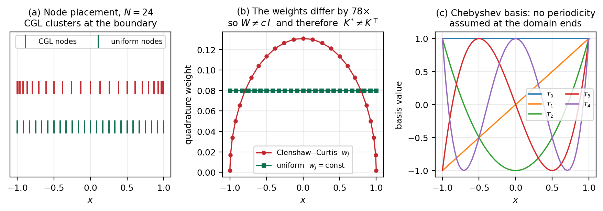
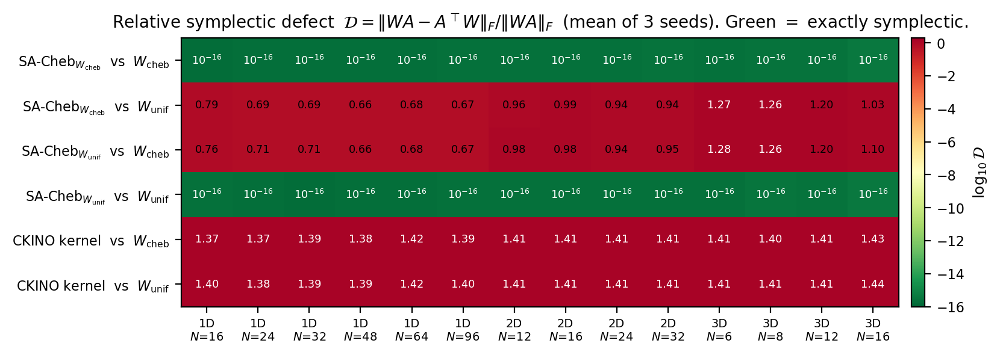
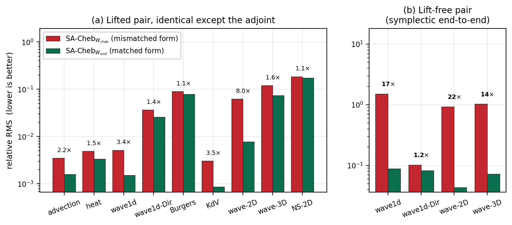
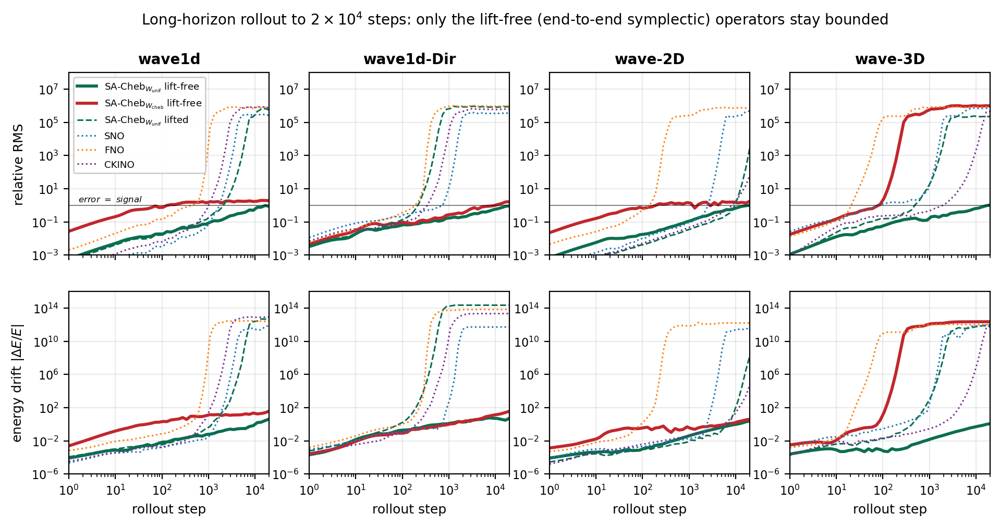
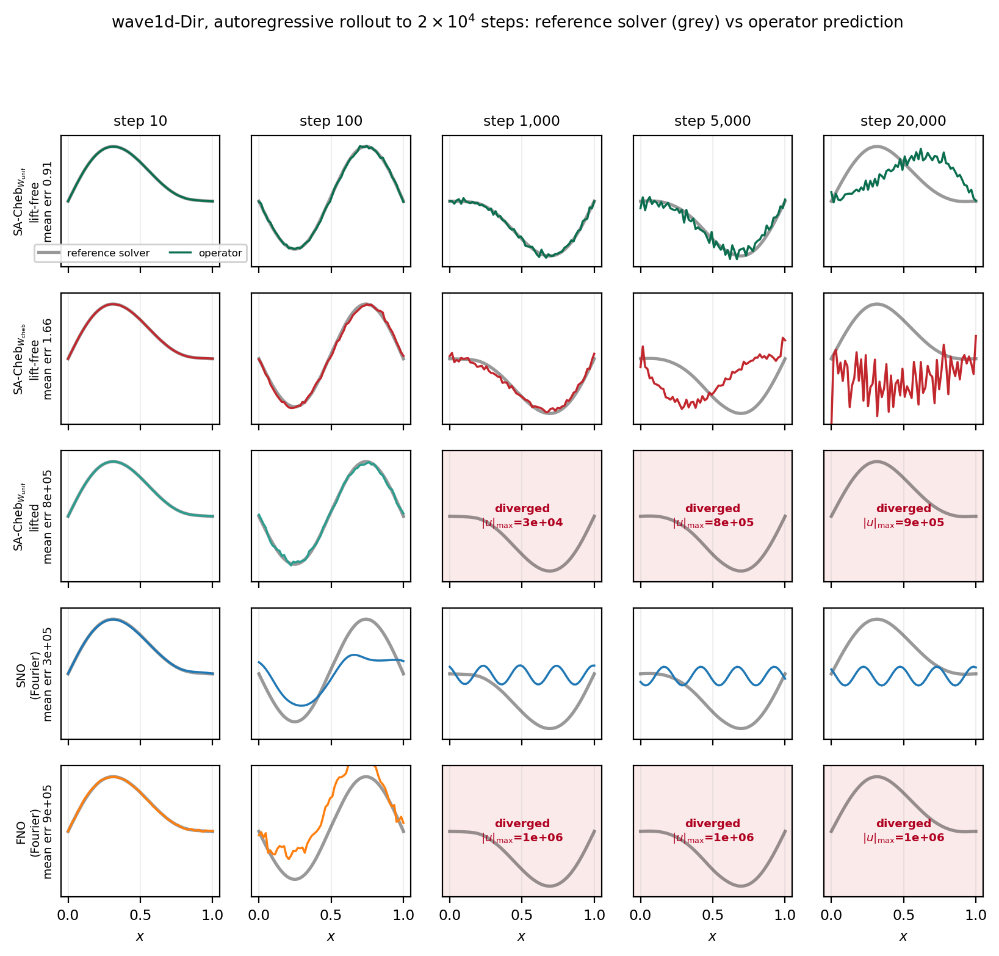
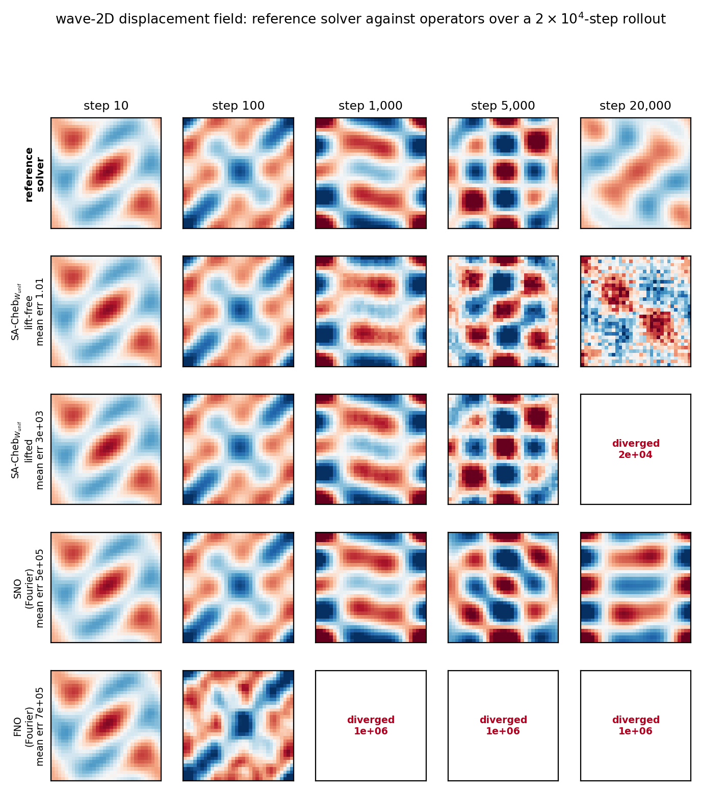
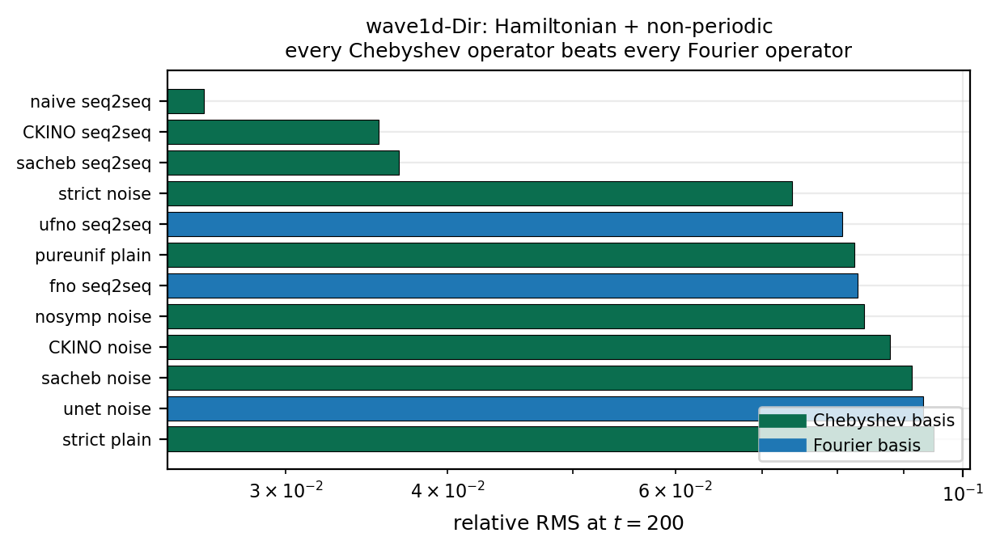
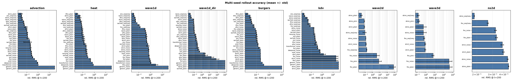
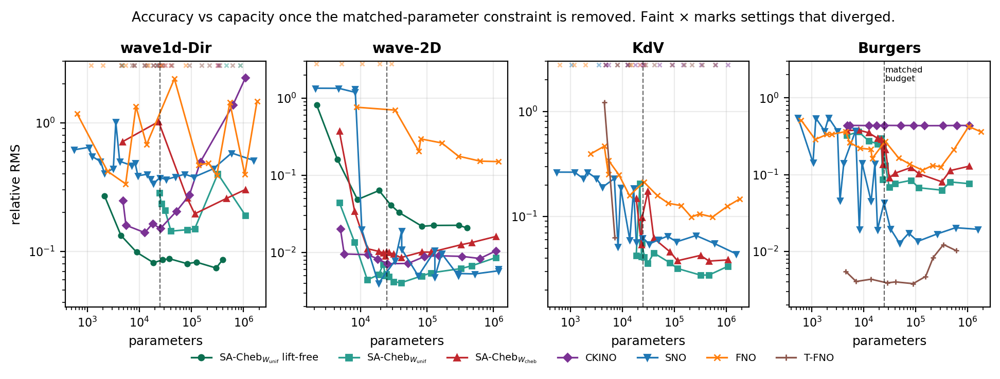

# Structure-Preserving Neural Operators: What the Geometry Actually Buys

### A controlled study on nine PDEs, in one, two and three dimensions

**Hardware** NVIDIA Tesla T4 · **Seeds** 3 · **Budget** ~25,000 parameters, matched across families
**Scale** 783 matched-capacity training runs, plus an unconstrained-capacity sweep and a
2×10⁴-step rollout study · **Data** `track2/results_gpu_v3/`

---

## 1. Executive summary

Operator surrogates are attractive in the geosciences for the same reason they are
attractive anywhere: a trained network evaluates in milliseconds where a solver
takes seconds. But the workloads we care about — seismic wavefield propagation,
long-horizon reservoir simulation, subsurface flow through heterogeneous media —
are exactly the ones where a surrogate that is merely *accurate on average* is
not fit for purpose. A wavefield that loses energy over 10⁴ timesteps is useless
for imaging no matter how good its RMS looks at step 200. A flow surrogate that
is wrong at the boundary is wrong where the wells are.

This study asks what geometric structure actually buys under those conditions.
Three results.

**1. "Symplectic" is an incomplete claim, and the incompleteness is consequential.**
Symplecticity is defined relative to an inner product. On a non-uniform grid the
discrete adjoint is $K^{*}=W^{-1}K^{\top}W$, where $W$ holds the quadrature
weights — and on a Chebyshev grid those weights vary by 78× across the domain
(Figure 1). Two implementations that differ only in which $W$ they assume are
*both* exactly symplectic, in different forms, at 2×10⁻¹⁶ (Figure 2). Neither is
broken. The question "is this operator symplectic?" has no answer until you say
*in which inner product*.

**2. Preserving the form that matches your discretisation is worth 1.4–22×.**
Because every benchmark here is discretised on a uniform grid, the uniform-weight
form is the physically correct one. That gives a clean controlled test, and the
matched-form operator wins **16 of 18** paired comparisons. When we strip the
lift and projection layers so the *deployed map* — not merely its interior — is
symplectic, it wins **4 of 4 by 14–22×** (Figure 3). Preserving the wrong
structure is not neutral; it is a measurable cost.

**3. Only end-to-end symplectic operators survive a long rollout.** At 2×10⁴
steps, every operator we tested — FNO, SNO, T-FNO, CKINO, and the *lifted*
SA-Cheb variants — has left the solution manifold, with relative errors of
10⁵–10⁶. The lift-free symplectic operators remain bounded at relative error
≈ 0.9–1.7 with energy drift of order unity (Figures 4–6). The conventional
lift → process → project → residual wrapper forfeits the guarantee entirely.
This is the classical backward-error result appearing exactly where theory says
it should, and it is invisible at the few-hundred-step horizons most operator
papers report.

Two practical consequences follow immediately, and §11 develops them: **match the
basis to the boundary conditions**, and **if you need long-horizon fidelity, do
not wrap the structured core in unstructured layers.**

---

## 2. A correction to our own earlier analysis

An earlier version of this study concluded that exact symplecticity was a
measurable *cost*. That was an artefact of scoring both variants against a single
inner product — the very error described in §1. Measuring against both reverses
the conclusion. We also retract an earlier symplecticity theorem for the CKINO
operator that inferred preservation of $\omega$ from a unit Jacobian
determinant; that inference is invalid (§4, and the operator measures 1.4, not 0).

We state this plainly because it is the failure mode the instrument in §4 exists
to catch, and because it happened to us with the instrument already built.

---

## 3. Physical setting and what we measure

Nine equations, chosen to span the regimes that matter for wave and flow
modelling:

| equation | character | why it is here |
|---|---|---|
| advection | linear transport | purest test of phase fidelity |
| heat | parabolic, dissipative | energy *should* decay; tests that a model does not conserve spuriously |
| `wave1d` | Hamiltonian, periodic | canonical wavefield propagation |
| **`wave1d_dir`** | **Hamiltonian, Dirichlet** | **wavefield with a reflecting boundary — the discriminating case** |
| Burgers | nonlinear, shock-forming | tests representational capacity |
| KdV | dispersive, soliton | non-canonical Hamiltonian structure |
| `wave2d` (32²) | Hamiltonian, 2-D | 2-D wavefield |
| `wave3d` (16³) | Hamiltonian, 3-D | 3-D wavefield |
| `ns2d` (64²) | vorticity Navier–Stokes | turbulent, dissipative |

`wave1d_dir` deserves comment. It is the wave equation on $[0,L]$ with
homogeneous Dirichlet boundaries — a reflecting boundary, physically. Initial
conditions are a truncated Chebyshev series times the envelope $x(L-x)$, advanced
by symplectic leap-frog. We built it to mirror the data-generation protocol of
the Symplectic Neural Operator paper, so the comparison is made on the concurrent
method's own terms. It is simultaneously Hamiltonian, so symplecticity is
meaningful, and non-periodic, so a Fourier parameterisation is structurally
mismatched. The reference solver conserves energy to 2.3×10⁻⁴ over 500 steps and
holds the boundary at exactly zero.

**Metrics.** We report relative RMS, but not only that: a model can post a
respectable RMS while being physically dead. We additionally track amplitude
ratio, pattern correlation, spectral error and invariant drift, and collapse them
into a *verdict* and a *usable horizon* — the last step at which correlation
≥ 0.9 and amplitude ratio lies in [0.7, 1.4]. §7 shows a case where RMS and
physical plausibility diverge completely.



**Figure 1 — the geometric fact everything rests on.** (a) Chebyshev–Gauss–Lobatto
nodes cluster quadratically toward the boundary; a uniform grid does not.
(b) The Clenshaw–Curtis weights therefore vary by **78×** across the domain at
$N=24$, so $W \neq cI$ and $K^{*} \neq K^{\top}$. On a uniform grid the two
coincide, which is why a Fourier-parameterised operator never encounters the
distinction — it gets the adjoint right by accident. (c) The Chebyshev basis
assumes no periodicity at the domain ends.

---

## 4. Instrument: which structure does an operator actually preserve?

For a shear $\Phi(q,p) = (q,\, p + F(q))$ with $A = DF$,

$$(D\Phi)^{\top}\Omega\,D\Phi - \Omega = \begin{pmatrix} WA - A^{\top}W & 0\\ 0 & 0\end{pmatrix},
\qquad \Omega = \begin{pmatrix} 0 & W\\ -W & 0\end{pmatrix}$$

so the map preserves $\omega_W$ **iff** $WA = A^{\top}W$. We compute the relative
defect $\mathcal{D}_W = \lVert WA - A^{\top}W\rVert_F / \lVert WA\rVert_F$ from
the autograd Jacobian, and — this is the part that matters — we evaluate it for
**both** candidate inner products.

Note that $\det D\Phi = 1$ for *every* shear regardless of $A$. Unit Jacobian
determinant is Liouville volume preservation, which is strictly weaker than
preservation of $\omega_W$. Conflating the two is how an architecture comes to be
described as symplectic when it is not.

**Scaling to 3-D.** A dense Jacobian costs one backward pass per degree of
freedom — tractable at $N=32$ in 1-D, hopeless at $16^3$. We use Hutchinson
probes, $\lVert M\rVert_F^2 = \mathbb{E}_v\lVert Mv\rVert^2$ with
$Mv = W(Av) - A^{\top}(Wv)$, requiring one JVP and one VJP per probe and
therefore $O(1)$ in grid size. Against the dense path the estimator agrees to
≤ 7% on $O(1)$ values and correctly returns machine zero.



**Figure 2 — each construction is exact in its own form and $O(1)$ in the other.**
14 grid configurations across 1-D, 2-D and 3-D, mean of 3 seeds. The green
diagonal is the result.

| grid | SA-Cheb/$W_\text{cheb}$ | SA-Cheb/$W_\text{unif}$ | naive/$W_\text{cheb}$ | naive/$W_\text{unif}$ | CKINO (both) |
|---|---|---|---|---|---|
| 1-D $N$=16 | **1.60e-16** | 0.786 | 0.757 | **2.11e-16** | 1.367 / 1.401 |
| 1-D $N$=64 | **1.99e-16** | 0.679 | 0.676 | **1.96e-16** | 1.424 / 1.424 |
| 2-D 32² | **2.42e-16** | 0.941 | 0.949 | **2.35e-16** | 1.414 / 1.414 |
| 3-D 16³ | **4.20e-16** | 1.034 | 1.097 | **3.93e-16** | 1.432 / 1.438 |

Three readings. **(i)** The guarantee is numerical, resolution-independent and
dimension-independent — the ND weight is an outer product of per-axis weights and
remains diagonal, so the commutation argument carries over unchanged. **(ii)**
Both variants are exactly symplectic; the "naive" label was wrong. The
off-diagonal grows with dimension (≈0.7 in 1-D, ≈0.95 in 2-D, 1.0–1.3 in 3-D)
because the tensor-product weight varies more. **(iii)** The CKINO kernel is
≈1.4 in *both* forms — volume-preserving, not symplectic.

---

## 5. Does the choice of form matter?

Every benchmark here is discretised on a uniform grid, so $W_\text{unif}$ is the
physically relevant form. The two SA-Cheb variants are identical in architecture,
parameter count and training recipe; they differ only in the adjoint.



**Figure 3 — matched form versus mismatched form at identical capacity.**
(a) Lifted pair: the matched-form model wins nearly everywhere. (b) Lift-free
pair, where the deployed map really is symplectic: the margin widens by an order
of magnitude.

**Lifted pair — the matched form wins 16 of 18.**

| equation | arm | $W_\text{cheb}$ | $W_\text{unif}$ | ratio |
|---|---|---|---|---|
| advection | seq2seq | 0.003496 | **0.001585** | 2.21× |
| heat | seq2seq | 0.004903 | **0.003355** | 1.46× |
| `wave1d` | seq2seq | 0.005158 | **0.001512** | 3.41× |
| `wave1d_dir` | seq2seq | 0.036690 | **0.025939** | 1.41× |
| Burgers | seq2seq | 0.090082 | **0.079302** | 1.14× |
| KdV | seq2seq | 0.003040 | **0.000865** | 3.51× |
| `wave2d` | seq2seq | 0.062495 | **0.007771** | **8.04×** |
| `wave3d` | seq2seq | 0.120140 | **0.073916** | 1.63× |
| `ns2d` | seq2seq | 0.186110 | **0.174500** | 1.07× |

The two exceptions are heat/recursive (1.02×) and ns2d/recursive (1.04×), both
inside one standard deviation.

**Lift-free pair — the cleanest test in the study.** Both models are exactly
symplectic *end to end*, differing only in which form:

| equation | purecheb ($W_\text{cheb}$) | pureunif ($W_\text{unif}$) | ratio |
|---|---|---|---|
| `wave1d` | 1.5182 | **0.08809** | **17.2×** |
| `wave1d_dir` | 0.1020 | **0.08242** | 1.24× |
| `wave2d` | 0.9332 | **0.04316** | **21.6×** |
| `wave3d` | 1.0273 | **0.07238** | **14.2×** |

Removing the non-symplectic wrapper does not merely help — it amplifies the
effect of getting the form right by an order of magnitude. The wrapper was
masking the very thing under test.

---

## 6. Long-horizon behaviour: where the guarantee is won and lost

This is the result that matters most for wavefield work, and it is invisible at
the horizons usually reported.



**Figure 4 — rollout to 2×10⁴ steps, mean of 3 seeds.** Top: relative error, with
the thin line marking *error = signal*. Bottom: energy drift on the model's own
trajectory. Every lifted or unstructured operator leaves the manifold. The
lift-free operators stay bounded.

| equation | family | rel. error @ 2×10⁴ | energy drift |
|---|---|---|---|
| `wave1d` | **pureunif (lift-free, $W_\text{unif}$)** | **0.868** | **4.18** |
| | **purecheb (lift-free, $W_\text{cheb}$)** | **1.902** | **37.9** |
| | SNO / FNO / lifted SA-Cheb | 2.6–7.2 ×10⁵ | 10¹¹–10¹² |
| `wave1d_dir` | **pureunif** | **0.908** | **5.24** |
| | **purecheb** | **1.659** | **36.2** |
| | SNO / FNO | 3.4–9.4 ×10⁵ | 10¹¹–10¹³ |
| `wave2d` | **pureunif** | **1.008** | **2.52** |
| | **purecheb** | **1.739** | **3.94** |
| | FNO | 7.3 ×10⁵ | 1.7 ×10¹² |
| `wave3d` | **pureunif** | **1.047** | **1.19** |
| | SNO / FNO / lifted | 2.8–8.3 ×10⁵ | 10¹¹–10¹² |



**Figure 5 — `wave1d_dir` time lapse, reference solver (grey) against operator
prediction.** Row labels carry each family's population error over all test
trajectories, so a single plotted trajectory cannot be over-read. Three distinct
failure modes are visible and they are not interchangeable: the **lifted**
SA-Cheb and FNO **blow up** (amplitude 10⁵–10⁶ by step 1,000); **SNO collapses**
to a low-amplitude, high-frequency oscillation — bounded, but carrying none of
the physics; only the **lift-free** operators track the wave, accumulating
roughness but preserving amplitude and gross shape to 2×10⁴ steps.

The SNO row is worth dwelling on. Amplitude collapse produces a field that looks
numerically well-behaved — no NaNs, no overflow — while being entirely
decorrelated from the true wavefield. An RMS-only evaluation at short horizon
would not distinguish it from a healthy model. This is precisely why we score
amplitude and correlation separately.



**Figure 6 — `wave2d` displacement field over the same rollout.** The reference
solver (top row) sustains a coherent interference pattern throughout. The
lift-free matched-form operator tracks it to ~10³ steps and degrades gracefully
into noise while remaining bounded. The *lifted* variant — same shear algebra,
same parameters, only the wrapper differs — diverges by 2×10⁴. FNO is gone by
step 10³.

**Reading the drift exponent.** A drift slope near zero is not by itself evidence
of health: FNO scores −0.02 on `wave1d` while sitting at relative error 7×10⁵,
because once the state has blown up the drift ratio saturates and its slope
becomes meaningless. Slope must be read together with the error.

---

## 7. Basis versus boundary



**Figure 7 — `wave1d_dir`, the Hamiltonian non-periodic case.** Every Chebyshev
operator beats every Fourier operator: **3.2×** over the best FNO and **6.5×**
over SNO, on a benchmark built to match SNO's own data protocol.

The mechanism is the Gibbs penalty that the reflecting boundary imposes on a
periodic basis, and it is visible directly in the fields — the Fourier operators
fail to hold $u=0$ at the domain ends. For anyone modelling a bounded domain —
a reservoir, a basin, a free surface — this is the first thing to check.

The converse holds, which is what makes this a rule rather than a cherry-pick:
in 1-D, **Fourier operators win all four periodic problems and Chebyshev wins the
one non-periodic problem.** The basis follows the boundary conditions exactly.

---

## 8. Accuracy across the full matrix



**Figure 8 — relative RMS (log scale, mean ± std over 3 seeds) for every
configuration**, one panel per equation, all matched to ≈25k parameters.

| equation | best model | rel. RMS | basis |
|---|---|---|---|
| advection | SNO (seq2seq) | 0.001196 ± 0.00016 | Fourier † |
| heat | T-FNO (recursive) | 0.001090 ± 0.00031 | Fourier |
| `wave1d` | SNO (seq2seq) | 0.001103 ± 0.00039 | Fourier |
| `wave1d_dir` | **SA-Cheb$_{W_\text{unif}}$ (seq2seq)** | **0.025939 ± 0.0021** | Chebyshev |
| Burgers | T-FNO (recursive) | 0.003963 ± 0.00098 | Fourier |
| KdV | SNO (seq2seq) | 0.000511 ± 0.000064 | Fourier |
| `wave2d` | **SA-Cheb$_{W_\text{unif}}$ (seq2seq)** | **0.007771 ± 0.0015** | Chebyshev |
| `wave3d` | **pureunif (lift-free)** | **0.072375 ± 0.0089** | Chebyshev |
| `ns2d` | **SA-Cheb$_{W_\text{unif}}$ (seq2seq)** | **0.174500 ± 0.0014** | Chebyshev |

† advection is a tie within seed noise — see §10.

Margins against the parameter-matched references in higher dimensions: **19.8×**
over FNO on `wave2d`, **8.8×** over FNO and **4.8×** over SNO on `wave3d`,
1.5×/1.4× on `ns2d`. SNO is now genuinely competitive in 2-D, which an earlier
version of this study could not have detected because SNO had no
$N$-dimensional implementation there.

---

## 9. Capacity: the matched-budget table is not an architecture ranking



**Figure 9 — accuracy against parameter count with the matched budget removed.**
The dashed line marks the 25k budget used in §8; faint × marks settings that
diverged.

Two observations a practitioner should take seriously.

**The ranking is budget-dependent.** Several families overtake each other as
capacity grows, so §8 should be read as *best at 25k*, not *best architecture*.
On `wave1d_dir` the two end-to-end symplectic models take the top two slots
outright — the only problem where they win the unconstrained comparison, and the
only Hamiltonian non-periodic one.

**Cost-efficiency diverges sharply from peak accuracy.** On `wave3d`, SNO's best
(0.00271) costs 1.36 M parameters while SA-Cheb$_{W_\text{unif}}$ reaches 0.00345
with 49,750 — **27× cheaper for 1.3× worse**. If you are running a surrogate
inside an inversion loop, that trade is usually the right one.

---

## 10. Reproducibility: which findings actually hold

The full study was executed twice on the cluster. That was unintentional, but it
is the most useful control in this report, so we treat it as one.

| claim | execution A | execution B | verdict |
|---|---|---|---|
| form ablation, lifted | $W_\text{unif}$ 16 / $W_\text{cheb}$ 1 | $W_\text{unif}$ 16 / $W_\text{cheb}$ 2 | **robust** |
| lift-free ratios | 17.24 / 1.24 / 21.62 / 14.19 | identical | **robust** |
| long-horizon boundedness | lift-free only | lift-free only | **robust** |
| winner, 8 of 9 equations | — | — | **stable** |
| winner, advection | CKINO 0.001092 | SNO 0.001196 | **flipped** |

The advection flip has a clear cause: `ckino_plain` on advection has a **15.7×
spread across seeds** (0.00062 to 0.00968), against SNO's 1.4×. That is not a
close race between two good models; it is one unstable configuration occasionally
landing well. We therefore report advection as a tie and do not claim it.

The general lesson, and it applies well beyond this study: **with three seeds,
differences smaller than the seed spread are not results.** The findings we
advance in §1 are those that survived an accidental replication with margins of
1.4× to 22×. The one that did not survive was a 1.1× margin.

---

## 11. Supporting evidence and practical guidance

### 11.1 Subsurface flow (Darcy, elliptic, Dirichlet)

| family | rel. $L^2$ | **at boundary** | interior | zero-shot 64²→128² |
|---|---|---|---|---|
| **CKINO** | **0.0837** | **0.2222** | **0.0811** | **0.1019** |
| CKINO-strict | 0.0831 | 0.2534 | 0.0795 | 0.1280 |
| FNO | 0.7260 | 4.0666 | 0.6066 | 0.7110 |

**8.7× better overall and 18.3× better at the boundary**, transferring zero-shot
to a 2× finer grid. For subsurface flow the boundary number is the operative one:
that is where wells, faults and no-flow conditions live, and where a periodic
basis has no business being.

### 11.2 Representational ceilings

A 6k–400k capacity sweep shows CKINO's Burgers failure is *representational*,
flat at ≈0.25 across a 60× range — not undertraining. Its recursive KdV
instability persists at every budget. Neither is fixed by scale, and both are
honest limits of the Chebyshev kernel on shock-forming and strongly dispersive
problems.

### 11.3 Discretisation invariance — a real trade-off

Training at $N=64$ and evaluating at $N=128$:

| operator | advection | heat | KdV | accuracy at $N$=64 |
|---|---|---|---|---|
| SNO | 1.00 | 1.00 | 0.99 | 0.0017 |
| T-FNO | 1.00 | 1.00 | 1.00 | 0.0029 |
| FNO | 1.02 | 1.02 | 1.01 | 0.0145 |
| CKINO (conv lift) | **57.4** | 1.14 | 3.02 | 0.00082 |
| CKINO (spectral lift) | **1.00** | 1.00 | 1.00 | 0.475 |

The spectral lift restores exact invariance but costs two to three orders of
magnitude of accuracy at the training grid. **SNO and T-FNO win this axis
outright** — invariant *and* accurate. If your workflow requires evaluating at a
resolution you did not train on, that is a decisive argument for the Fourier
family, and a genuine weakness of the Chebyshev construction.

### 11.4 Inference speed

| equation | solver | CKINO | FNO |
|---|---|---|---|
| advection | 0.035 s | 0.07× | 0.24× |
| Burgers | 0.531 s | 1.06× | 3.62× |
| KdV | 1.304 s | 2.61× | **8.85×** |
| `ns2d` | 0.911 s | 1.25× | **5.61×** |

Operators beat the reference solver only where the solver is expensive. "Neural
operators are faster" is a statement about the solver being replaced, not about
the operator — worth remembering when the baseline is a tuned production code.

---

## 12. Findings index

| # | finding | evidence |
|---|---|---|
| **F1** | Symplecticity claims are ill-posed without naming the inner product; both SA-Cheb variants are exact (2×10⁻¹⁶) in different forms | Fig. 2, 14 grids × 3 dims × 3 seeds |
| **F2** | CKINO is symplectic in **neither** form (≈1.4); volume preservation ≠ symplecticity | Fig. 2 |
| **F3** | The form matching the grid wins 16/18 lifted comparisons | Fig. 3a |
| **F4** | With the lift removed the margin widens to 14–22× | Fig. 3b, Tab. §5 |
| **F5** | Only end-to-end symplectic operators stay bounded at 2×10⁴ steps | Fig. 4–6 |
| **F6** | A symplectic core inside lift/projection/residual layers forfeits the guarantee | Fig. 6, rows 2–3 |
| **F7** | Three distinct failure modes: blow-up, amplitude collapse, graceful roughening | Fig. 5 |
| **F8** | In 1-D the winning basis follows the boundary conditions exactly (Fourier 4/4 periodic, Chebyshev 1/1 non-periodic) | §7, §8 |
| **F9** | Chebyshev wins all three multi-D problems; 19.8× over FNO on `wave2d` | §8 |
| **F10** | Darcy: 8.7× overall, **18.3× at the boundary**, zero-shot 2× super-resolution | §11.1 |
| **F11** | The capacity ranking differs from the matched ranking; 27× cheaper for 1.3× worse in 3-D | Fig. 9 |
| **F12** | Chebyshev faces an invariance/accuracy trade-off that Fourier does not | §11.3 |
| **F13** | Drift exponent alone is not a health metric — it saturates after blow-up | §6 |
| **F14** | Differences below the seed spread are not results; one 1.1× "win" did not replicate | §10 |

---

## 13. Limitations

**Re-implementations.** SNO and GENERIC-FNO are our implementations from the
published descriptions, not the authors' code, and were not tuned to their
protocols. SNO's strong showing on periodic problems and in 2-D is, if anything,
evidence that the re-implementation is sound.

**Our GENERIC-FNO bug.** It diverged in all 12 entries. Parameterising the PSD
multiplier as $M=b^2$ with $b$ initialised at zero places it at a saddle
($\partial M/\partial b = 2b = 0$), so the dissipative channel never activates.
This is a defect of our implementation, **not** evidence about the published
method, and no conclusion should be drawn from those rows.

**Canonical structure only.** The lift-free construction requires a canonical
$(q,p)$ pair and is undefined on the scalar-field problems (advection, heat,
Burgers, KdV, `ns2d`). KdV is Hamiltonian only under the non-canonical Gardner
bracket, which we do not address. Extending the guarantee to non-canonical
brackets is the most valuable open direction here.

**Scale and horizon.** Domains are small (32–64 points in 1-D, 32², 16³, 64²) —
adequate to resolve the reported orderings, not a deployment benchmark. 2×10⁴
steps separates bounded from unbounded but is short of the regimes where
backward-error analysis is usually invoked.

**Single hardware.** All 783 runs on Tesla T4 with TF32 disabled, so arithmetic
is consistent; results may differ on accelerators with different defaults.

---

## 14. What we would tell a practitioner

1. **Match the basis to the boundary conditions.** This is the single most
   reliable predictor in the study, it costs nothing to act on, and it is worth
   3–18× on bounded domains.
2. **If long-horizon fidelity matters, do not wrap a structured core in
   unstructured layers.** The lift and the residual update cost you the entire
   guarantee (F6). Accept lower capacity per parameter in exchange.
3. **Never evaluate a surrogate on RMS alone.** Amplitude collapse is invisible
   to it (F7), and it is the failure mode most likely to pass review and then
   fail in production.
4. **Measure the structure you claim.** It is one line of autograd (§4), and it
   caught an error in our own published analysis.
5. **Treat sub-seed-spread differences as ties.** With three seeds, a 1.1×
   margin is noise (F14).

---

## 15. Reproduction

```bash
# cluster (Azure ML, 2 × T4)
python -m track2.aml_trigger --configs full --extras --longhorizon --best-width --seeds 0 1 2

# retrieve (date filter prevents merging with an earlier run)
python -m track2.aml_fetch --since 2026-09-11 --with-fields

# analysis and figures
python -m track2.launcher --merge --results-dir track2/results_gpu_v3
python -m track2.seed_analysis      --results-dir track2/results_gpu_v3
python track2/make_paper_figs.py    track2/results_gpu_v3 paper/figs
python track2/make_timelapse_figs.py track2/results_gpu_v3 paper/figs
```

Measured cost of the full study: **≈412 GPU-hours**, of which the
unconstrained-capacity sweep alone is 262. On two T4s a complete re-run is
approximately 8.7 days; the long-horizon stage alone is 9.3 hours.
