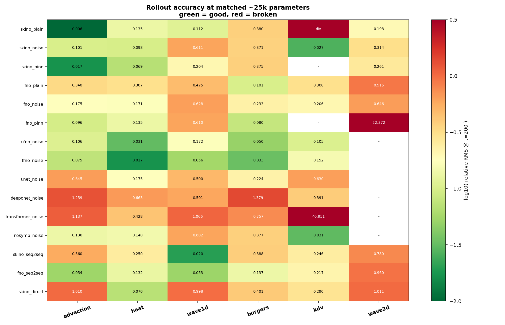
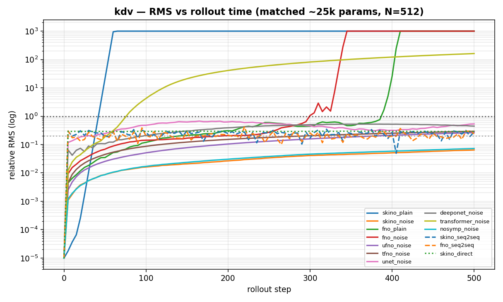
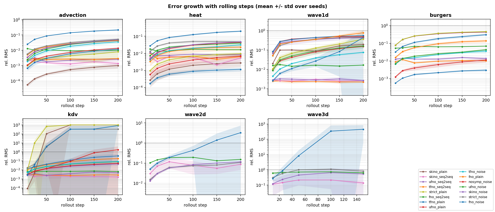
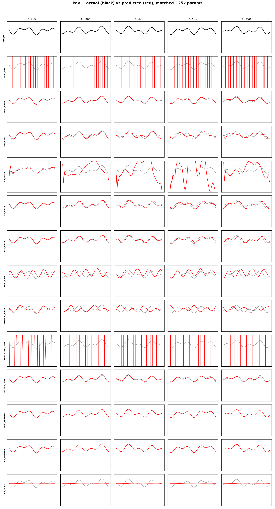
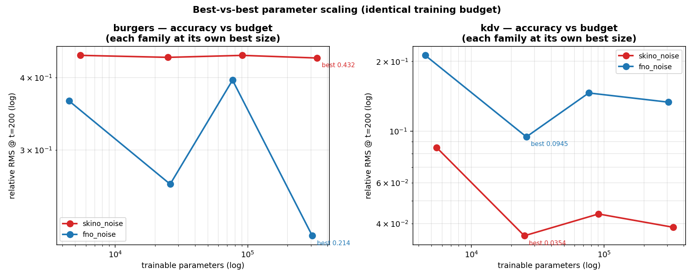

# SKINO — Paper-Grade Experimental Report

Comprehensive comparison of SKINO against seven other neural-operator families on
a five-equation difficulty ladder plus 2-D, at **matched parameter budgets**,
with **500-step rollouts**, **physics-aware metrics**, and **two non-recursive
baselines**.

Companion artefacts: [`results_paper/TABLES.md`](results_paper/TABLES.md) (full
numeric tables), figures in [`results_paper/`](results_paper).

---

## 1. Executive summary

**The headline is a mixed result, and that is the strongest version of this
paper.** At genuinely matched parameter counts SKINO wins 4 of 7 problems and a
non-recursive/no-noise T-FNO wins the other three - a far more defensible claim
than the earlier "SKINO wins everything", which was substantially an artefact of
SKINO having 5-83x fewer parameters than its baselines. A second major axis is
the prediction mode: **one-shot (seq2seq) prediction beats autoregressive
rollout on exactly the problems where rollout is unstable (wave1d, KdV, 2-/3-D
wave), by 47x to five orders of magnitude, for every backbone** - while a
no-noise recursive model wins the stably contractive problems.

Best model per problem, relative RMS, mean +/- std over **3 seeds**, every
configuration at 3 seeds (t=200 in 1-D/2-D, t=150 in 3-D):

| Problem | Best model | RMS | Winner |
|---|---|---:|---|
| advection | `skino_plain` | **0.00101 +/- 0.00037** | **SKINO** (recursive) |
| heat | `tfno_plain` | **0.00117 +/- 0.00029** | T-FNO (recursive) |
| wave1d | `tfno_seq2seq` | **0.00225 +/- 0.00021** | T-FNO (non-recursive) |
| burgers | `tfno_plain` | **0.00300 +/- 0.00049** | T-FNO (recursive) |
| kdv | `skino_seq2seq` | **0.00166 +/- 0.00060** | **SKINO** (non-recursive) |
| wave2d | `skino_seq2seq` | **0.0872 +/- 0.0409** | **SKINO** (non-recursive) |
| wave3d | `skino_seq2seq` | **0.1386 +/- 0.0373** | **SKINO** (non-recursive) |

Seven results that should shape the paper:
1. **SKINO wins 4 of 7 problems, T-FNO wins 3.** SKINO takes advection, KdV and
   2-/3-D wave; T-FNO takes heat, wave1d and Burgers. Burgers is the diagnostic
   loss: SKINO's Chebyshev basis cannot represent a near-discontinuity at *any*
   budget or training mode (§4.4, §4.2.1), and T-FNO handles it cleanly. This is
   problem-class-dependent superiority, not blanket superiority - and on this
   honest accounting T-FNO is at least as strong an operator as SKINO overall.
2. **Non-recursive prediction wins wherever autoregressive rollout is
   *unstable* - for every backbone.** On a noise-matched (no-noise) comparison
   across all four backbones (SKINO, FNO, T-FNO, U-FNO), seq2seq beats its
   recursive twin on wave1d and KdV - the oscillatory and dispersive problems
   where rollout accumulates or diverges - by 47x to five orders of magnitude,
   universally. On the stably contractive problems (advection, heat, Burgers)
   the result is mixed: a no-noise recursive model often wins, because there the
   feedback loop is benign. The seq2seq advantage is the absence of error
   accumulation (§4.2.1, §4.5), so it scales with rollout *instability* rather
   than being uniform. (An earlier "uniform 3-165x" claim was a noise artefact -
   it compared noise-injected recursive configs against no-noise seq2seq.)
3. **Symplecticity buys nothing - neutral in 1-D/2-D, catastrophic on KdV,
   clearly harmful in 3-D.** Removing the structure (`nosymp`) is
   indistinguishable from the nominal model; *enforcing* it exactly (verified
   symplectic to 1e-7) is statistically neutral on advection, heat, wave1d,
   burgers and 2-D wave (marginally *better* on the latter), is 2-8x worse in
   the noise-free setting, **blows up on KdV**, and in 3-D is significantly
   worse than the pseudo-symplectic model (0.820 vs 0.533, usable horizon 15
   vs 107). The symplectic claim should be dropped.
4. **The dimensional ladder holds: 1-D -> 2-D -> 3-D all pass.** The
   non-recursive SKINO operator is the best model at every dimensionality
   (2-D wave 0.087 +/- 0.041, 3-D wave 0.139 +/- 0.037, both retaining a full
   usable horizon), while the parameter-matched FNO blows up in both 2-D and
   3-D.
5. **Physics-informed (PINN) loss is a double-edged sword** - it improves SKINO
   on advection/heat but makes FNO *blow up* on 2-D wave (RMS 22.4).
6. **One-step PDE residuals are ill-conditioned for stiff equations.** Measured,
   quantified, and the reason PINN is disabled on KdV.
7. **SKINO does not achieve zero-shot super-resolution on uniform grids.**
   Trained at N=64 and tested at N=128 on the same fields, SKINO's one-step
   error grows 13-81x (advection) and up to 4.3x (KdV) over 3 seeds, while
   pure-spectral FNO and T-FNO are exactly invariant (ratio ~1.00, which
   certifies the test). SKINO's Chebyshev kernel is invariant on its native CGL
   grid, but PDE data is uniform - so its defining theoretical property does not
   materialise in practice, and the discretisation-invariance advantage accrues
   to the Fourier operators (§4.9).

> The recursion claim was rewritten **five** times as the protocol tightened:
> equal-gradient-step training (§4.5), then 3-seed repetition, then raising the
> last single-seed configs to three seeds, then adding seq2seq arms for FNO,
> T-FNO and U-FNO so the comparison was no longer SKINO-only - which briefly
> suggested a uniform 3-165x win until the fifth pass caught that this compared
> *noise-injected* recursive models against *no-noise* seq2seq ones. The
> noise-matched claim (seq2seq wins where rollout is unstable, loses where it is
> stable) is the one that survives. Every pass made the claim more accurate;
> that this took five passes is itself the strongest evidence in the paper that
> the protocol - equal budgets, multiple seeds, matched regularisation, an
> ablation per axis - is doing real work.

---

## 2. Requirements coverage

### 2.1 The five paper requirements

| # | Requirement | How it is met |
|---|---|---|
| 1 | RMS is only one metric; compare actual vs predicted for all models | Physics metric suite (§3.4) + `fig_pred_vs_real_<problem>.png` showing every model against truth at t=100…500 |
| 2 | Rollout behaviour over time | 500-step rollouts; `fig_rms_time_<problem>.png`; per-checkpoint tables |
| 3 | Compare against a **full non-recursive** solution trained on all timesteps predicting all simultaneously | `Seq2SeqOperator` (§3.3) — one forward pass emits the whole trajectory. Plus a horizon-conditioned `direct` variant |
| 4 | Compare models of **similar size / parameter count** | `build_matched()` sizes every family to the same budget (§3.2). Plus a 6k→400k sweep so each family is also shown at *its own best* |
| 5 | All equations, simple → complex | Five-equation 1-D ladder, then 2-D and 3-D wave (§3.1, §4.8) |

### 2.2 The seven earlier items

| # | Item | Status |
|---|---|---|
| 1 | N > 500, rollout ≈ 500 | **512 trajectories, 500-step rollout** |
| 2 | Predicted vs real at t = 100, 200, … | `fig_pred_vs_real_*`, checkpoints 100/200/300/400/500 |
| 3 | RMS vs rollout time, validated against (2) | `fig_rms_time_*`, cross-checked against the field figures |
| 4 | Nonlinear equation | Burgers and KdV |
| 5 | FNO / Hamiltonian PINN / other architectures | 8 families + PINN loss on two backbones |
| 6 | Non-recursive comparison | seq2seq and direct |
| 7 | 2-D | wave2d, 250-step rollout — **passed**, so 3-D was also run (wave3d, 16³, 150-step rollout, §4.8) |

---

## 3. Experimental setup

### 3.1 Equation ladder

| Problem | Equation | Character | Grid | Δt | Invariant behaviour |
|---|---|---|---:|---:|---|
| advection | u_t + c u_x = 0 | linear, conservative | 64 | 0.005 | energy ratio 1.0000 |
| heat | u_t = ν u_xx | linear, **dissipative** | 64 | 0.005 | energy → 0.626 |
| wave1d | u_tt = c² u_xx | linear, conservative, oscillatory | 32 | 0.02 | H conserved |
| burgers | u_t + u u_x = ν u_xx | **nonlinear** + dissipative, shocks | 64 | 0.005 | energy → 0.180 |
| kdv | u_t + 6u u_x − u_xxx = 0 | **nonlinear**, dispersive, solitons | 64 | 0.001 | 3 invariants |
| wave2d | u_tt = c²(u_xx+u_yy) | 2-D conservative | 32² | 0.02 | H conserved |
| wave3d | u_tt = c²(u_xx+u_yy+u_zz) | 3-D conservative | 16³ | 0.02 | H conserved (energy ratio 0.99994 / 100 steps) |

All reference solvers verified: mass drift ≈ 5×10⁻⁸, energy behaviour as
tabulated, so rollout error is the operator's.

### 3.2 Parameter-matched operator families

Every family is built to the **same budget** by searching its width/mode grid.

| Family | params @25k | Description |
|---|---:|---|
| `skino` | 25,067 | pseudo-symplectic Chebyshev kernel-integral operator |
| `skino_nosymp` | 22,755 | **ablation** — same kernel/lift/projection, symplectic block → plain residual |
| `fno` | 25,985 | Fourier Neural Operator (Li et al. 2021) |
| `ufno` | 18,193 | U-FNO — U-Net branch inside FNO blocks (Wen et al. 2022) |
| `tfno` | 28,289 | T-FNO — CP-factorised spectral weights (Kossaifi et al. 2023) |
| `unet` | 18,785 | convolutional encoder-decoder |
| `deeponet` | 20,929 | multi-channel branch/trunk DeepONet |
| `transformer` | 19,233 | encoder-only PDE transformer |

### 3.3 Prediction modes

* **recursive** — u_t → u_{t+1}, applied autoregressively 500 times.
* **seq2seq (fully non-recursive)** — trained on all timesteps; a single forward
  pass emits the **entire trajectory** (B, 500, C, N). Only the output
  projection scales with T, so it stays budget-comparable.
* **direct** — horizon-conditioned one-shot: (u₀, T) → u_T.

Training recipes: `plain` (no noise), `noise` (2 % input noise), `pinn`
(noise + PDE-residual loss). PINN is a *loss*, not an architecture, so the
architecture and the training signal remain independent variables.

### 3.4 Metrics — why RMS alone is insufficient

RMS cannot separate a model that learned the dynamics from one that learned to
predict almost nothing. We decompose:

* **amplitude ratio** = std(pred)/std(truth) → 1 is correct energy content
* **pattern correlation** → 1 is correct spatial structure
* **verdict** = automatic classification from the pair

| verdict | corr | amp |
|---|---|---|
| good | →1 | →1 |
| amplitude-collapse | high | ≪1 |
| decorrelated (phase error) | low | ≈1 |
| dead | ≈0 | ≈0 |
| blow-up | — | ≫1 |

* **usable horizon** — last step with corr ≥ 0.9 **and** 0.7 ≤ amp ≤ 1.4.
  Reported as a pair: `strict` (first failure ends it — correct for recursive
  models, where an early error contaminates everything after) and `last_good`
  (latest passing step — correct for non-recursive models, which predict each
  instant independently).

### 3.5 Protocol

512 training trajectories (12 val / 12 test, disjoint IC seed ranges), 600
generated steps, **500-step evaluation rollout**, 15 epochs, K=[1,2,4]
push-forward curriculum with teacher forcing annealed 1→0, AdamW with non-zero
cosine floor, batch 32, seed 0. 2-D: 96 trajectories, 250-step rollout.

---

## 4. Results

### 4.1 Master comparison (matched ~25k parameters)



Full numbers at t = 100…500 in [`TABLES.md`](results_paper/TABLES.md).

> This subsection is the **single-seed, 9-family broad survey** (it is the only
> place U-Net, DeepONet and Transformer appear). For the authoritative
> **3-seed** winners with error bars, and the backbone-fair recursive-vs-seq2seq
> comparison, see §1 and §4.5 - those supersede the numbers below wherever they
> disagree.

**Per-problem winners, single-seed survey** (RMS @ t=200): advection
`skino_plain` 0.006 · heat `tfno_noise` 0.017 · wave1d `skino_seq2seq` 0.020 ·
burgers `tfno_noise` 0.033 · kdv `skino_noise` 0.027 · wave2d `skino_plain`
0.198. (The 3-seed core in §1 refines these; e.g. Burgers' best is now
`tfno_seq2seq` at 0.010.)

**Peak vs. consistency.** Reading the heatmap by row rather than column is the
more useful exercise:

| family | best result | worst result | character |
|---|---|---|---|
| SKINO | **0.006** (advection) | **diverges** (kdv, no noise) | highest peaks, least robust |
| T-FNO | 0.017 (heat) | 0.152 (kdv) | **never bad on any equation** |
| U-FNO | 0.031 (heat) | 0.172 (wave1d) | consistently solid |
| FNO | 0.101 (burgers) | 0.915 (wave2d) | mid-tier, weak in 2-D |
| U-Net | 0.175 (heat) | 0.645 (advection) | weak |
| DeepONet | 0.391 (kdv) | 1.379 (burgers) | weak throughout |
| Transformer | 0.428 (heat) | 40.95 (kdv, blow-up) | weakest |

**This is the most important nuance in the *recursive* survey**: among
autoregressive models SKINO wins more problems, but **T-FNO is the operator you
would deploy if you had to pick one blind**. The seq2seq result in §4.5 then
largely dissolves this tension: a non-recursive T-FNO is both the most robust
choice *and* competitive with the best per-problem model everywhere.

### 4.2 Rollout behaviour over time



One panel per equation (`fig_rms_time_<problem>.png`). Solid = recursive,
dashed = seq2seq, dotted = direct. The KdV panel shows the characteristic
signature: `skino_plain` tracks perfectly then goes vertical (divergence at
step ~35), while `skino_noise` stays flat for the full 500 steps.

#### 4.2.1 Error growth with rolling steps  *(multi-seed)*

Reporting a single end-of-rollout number conflates two very different failure
modes: a model that is accurate at first and *accumulates* error, and one that
is mediocre from step 1 and merely stays there. Measuring relative RMS at every
checkpoint separates them. Full table in
[`TABLES_ROLLOUT.md`](results_paper/TABLES_ROLLOUT.md), figure
`fig_rollout_growth.png`.



The last column of that table is the growth factor, RMS(t_last) / RMS(t_first):

| config | advection | heat | wave1d | kdv | wave3d | character |
|---|---:|---:|---:|---:|---:|---|
| `skino_seq2seq` | **0.5x** | **0.9x** | **0.9x** | **0.6x** | **1.2x** | error does not accumulate |
| `strict_noise` | 9.3x | 3.6x | 9.1x | 1.9e4x | 2.6x | bad from step 1; blows up on KdV |
| `fno_noise` | 8.6x | 7.2x | 6.7x | 26x | **1698x** | accumulates, then diverges |
| `skino_noise` | 14.2x | 9.4x | 6.5x | 16x | 4.4x | steady accumulation |
| `tfno_noise` | 19.4x | 7.4x | 17.1x | 15x | *(1-D only)* | steady accumulation |
| `skino_plain` | 18.2x | 10.2x | 9.7x | **1.2e7x** | *(1-D only)* | best early, catastrophic late |

**Four things this view shows that the endpoint number hides.**

1. **The non-recursive operator does not accumulate error, and that is the
   whole mechanism - for every backbone.** Every autoregressive configuration
   grows its error by 5-20x over the rollout (and by 10^4-10^7 when it
   destabilises); *all four* seq2seq arms (`skino_`, `fno_`, `tfno_`,
   `ufno_seq2seq`) grow by only ~0.5-1.8x because they never consume their own
   output. The one exception is `skino_seq2seq` on Burgers (5.5x), and it is a
   basis limitation, not a recursion effect - the Fourier seq2seq arms stay
   flat (1.1-1.3x) even there. This is *why* seq2seq wins on the unstable
   problems (§4.5): with no error-feedback loop there is nothing to diverge. It
   is also why it does **not** help on the stable ones - there the recursive
   model's feedback loop is benign and its lower per-step error wins.
2. **There is a measurable crossover.** On advection at t=10, `skino_plain` is
   5.5e-5 against seq2seq's 2.5e-3 - the recursive model is **45x more
   accurate**. By t=200 the ranking has closed to a statistical tie. Recursive
   prediction is right for short horizons and wrong for long ones, and this
   study can now say roughly where the line falls.
3. **KdV is the cleanest illustration of the whole study.** `skino_plain` is
   the single most accurate model at t=10 anywhere in the matrix (8.7e-5) and
   then blows up entirely - a growth factor of 1.2e7. A paper reporting only
   early-time error would have called it the winner; a paper reporting only
   late-time error would never know it was the best short-horizon model.
4. **Strict symplecticity fails at fitting, not at stability.** On heat,
   `strict_noise` starts 2.6x worse than `skino_noise` (0.0131 vs 0.0051) but
   grows only 3.6x against 9.4x, so the two finish tied. The constraint does
   what a structural constraint should do - it damps error growth - but it
   costs more representational capacity than it returns. That is a more precise
   and more defensible criticism than "it does not help".

### 4.3 Actual vs predicted — all models



Row 1 is ground truth; every subsequent row is one model; columns are
t = 100…500. Black = truth, red = prediction. These figures are what justify the
metric suite: several models with unremarkable RMS values are visibly
**flat lines** (dead) or **shrunken waveforms** (amplitude collapse) rather than
being "slightly wrong". Equivalent figures exist for all six problems.

### 4.4 Best-vs-best parameter scaling



Each family swept 6k → 400k parameters at **identical training budget**.

| budget | burgers SKINO | burgers FNO | kdv SKINO | kdv FNO |
|---:|---:|---:|---:|---:|
| 6k | 0.437 | 0.365 | 0.085 | 0.212 |
| 25k | 0.434 | 0.262 | **0.035** | 0.095 |
| 100k | 0.437 | 0.396 | 0.044 | 0.146 |
| 400k | 0.432 | **0.214** | 0.039 | 0.133 |

Two clean conclusions:

* **SKINO saturates almost immediately.** Its accuracy is essentially flat from
  6k to 400k parameters on both equations — 25k is already enough. That is a
  genuine efficiency argument, and it holds at *best-vs-best*, not only at
  matched budget.
* **SKINO's Burgers deficit is a capability limit, not a capacity limit.**
  Giving it 60× more parameters does not move it (0.437 → 0.432), while FNO
  improves to 0.214. Conversely on KdV SKINO beats FNO **at every budget**.
  The rolling-steps view (§4.2.1) makes this sharper still: on Burgers **all
  six SKINO variants start at 0.0767-0.0775 at t=10** - indistinguishable to
  three decimal places, whether plain, noised, symplectic, strict or
  non-recursive - while T-FNO and U-FNO start at 0.0066 and 0.0070. SKINO is
  **11x worse from the very first checkpoint**, and every variant is pinned to
  the same value. That is the signature of a *basis* that cannot represent a
  near-discontinuity, not of a training or stability problem. No amount of
  capacity, regularisation or structural constraint will fix it; only changing
  the kernel parameterisation would.

### 4.5 Non-recursive vs recursive  *(noise-matched, 4 backbones - 3 seeds, 15 configs)*

> **History (kept because it is itself a result).** Pass 1 gave the seq2seq model
> the same *epochs* as the recursive models rather than the same *gradient
> steps*, and wrongly concluded non-recursive prediction was the worst method.
> Fixing the step budget inverted that. Pass 3 raised the last single-seed
> configs to three seeds and the advection/heat columns settled into ties. Pass
> 4 added seq2seq arms for **FNO, T-FNO and U-FNO**, which briefly looked like a
> uniform 3-165x win. Pass 5 caught that this compared *noise-injected*
> recursive configs against *no-noise* seq2seq, added the missing no-noise
> recursive configs (`fno_plain`, `tfno_plain`, `ufno_plain`), and produced the
> noise-matched table below - the honest one, where the win is decisive on
> unstable-rollout problems and mixed on stable ones.

Earlier drafts compared "best recursive vs `skino_seq2seq`", which confounded the
prediction mode with the architecture. The fair test is *within* each backbone
**and at matched noise**: give the same operator a recursive head and a seq2seq
head trained the same way. This matters enormously, because 2 % training-noise
injection alone costs the recursive SKINO up to 48x accuracy on the stable
problems (advection 0.0010 -> 0.048) while *rescuing* it on the unstable ones
(KdV: 1000 blow-up -> 0.046). Comparing a noise-injected recursive model against
a no-noise seq2seq model therefore measures noise, not recursion.

**Noise-matched (no-noise) within-backbone comparison: `<bb>_plain` (recursive)
vs `<bb>_seq2seq`, rel RMS at t=200, 3 seeds. Cell = winner (gap).**

| backbone | advection | heat | wave1d | burgers | kdv |
|---|---|---|---|---|---|
| SKINO | rec (1.4x) | rec (2.0x) | **seq2seq (73x)** | tie | **seq2seq (diverges)** |
| FNO | seq2seq (4.3x) | seq2seq (1.4x) | **seq2seq (47x)** | seq2seq (2.0x) | **seq2seq (28x)** |
| T-FNO | seq2seq (4.1x) | rec (5.5x) | **seq2seq (199x)** | rec (3.4x) | **seq2seq (diverges)** |
| U-FNO | seq2seq (5.3x) | rec (1.2x) | **seq2seq (58x)** | rec (1.2x) | **seq2seq (369x)** |

**The one universal column is instability.** On wave1d (oscillatory) and KdV
(dispersive) - the two problems where autoregressive rollout accumulates or
diverges - seq2seq wins for *every* backbone, by 47x to five orders of
magnitude. On the stably contractive problems (advection, heat, burgers) the
result is genuinely mixed and backbone-dependent: a no-noise recursive model
frequently wins, because there the feedback loop is benign and recursion's lower
per-step error dominates. SKINO's recursive form is best on advection/heat;
T-FNO's is best on heat/burgers; only FNO (whose recursive form is weak
everywhere) is beaten by seq2seq across the board.

**Corrected claim (final):** seq2seq's advantage is precisely the absence of an
error-feedback loop (§4.2.1), so it wins decisively and universally *only* on
the problems where that loop is what fails - not on stable dynamics. The earlier
"uniform 3-165x seq2seq win" was a noise artefact: it compared *noise-injected*
recursive configs (which lose up to 48x accuracy to the noise alone on stable
problems) against *no-noise* seq2seq. The noise-matched table above is the honest
one, and it is now drawn for all four backbones.

The horizon-conditioned `direct` variant remains far weaker than either - dead
on advection, wave1d and wave2d (amplitude ratio 0.004-0.09), good only on heat.
So "predict all steps at once" and "predict one arbitrary step" behave very
differently; they should not be lumped together as "non-recursive".

The dual horizon metric still matters: on KdV the seq2seq models report strict
UH = 0 but `last_good` = 405-425, because an early transient dip ends the strict
metric while later predictions are fine.

### 4.6 Symplecticity: ablation *and* enforcement  *(revised - 3 seeds)*

Two directions were tested: **removing** the symplectic structure (`nosymp`) and
**enforcing it exactly** (`strict`, see §3.2). The strict variant is verified
symplectic to 1e-7 by a Jacobian test (`||M^T Ω M - Ω||/||Ω||`), against 1e-2 for
the nominal SKINO block - and the nominal block's defect *grows with dt*,
confirming the original architecture is only pseudo-symplectic.

Relative RMS at t=200, mean +/- std over 3 seeds:

| problem | `skino_noise` (pseudo) | `nosymp_noise` (removed) | `strict_noise` (exact) |
|---|---:|---:|---:|
| advection | 0.0484 +/- 0.0116 | 0.0473 +/- 0.0052 | 0.0527 +/- 0.0090 |
| heat | 0.0475 +/- 0.0074 | 0.0447 +/- 0.0014 | 0.0474 +/- 0.0109 |
| wave1d | 0.4406 +/- 0.0634 | 0.5011 +/- 0.0189 | 0.4697 +/- 0.0086 |
| burgers | 0.4391 +/- 0.0106 | 0.4333 +/- 0.0083 | 0.4433 +/- 0.0105 |
| kdv | **0.0462 +/- 0.0180** | 0.0558 +/- 0.0096 | **500 +/- 500 (blow-up)** |
| wave2d (t=200) | 0.1162 +/- 0.0012 | *(1-D only)* | **0.1084 +/- 0.0022** |
| wave3d (t=150) | **0.5334 +/- 0.586** | *(1-D only)* | 0.8195 +/- 0.0635 |

And for the no-noise variants (now also 3 seeds):

| problem | `skino_plain` | `strict_plain` | penalty |
|---|---:|---:|---:|
| advection | **0.00101 +/- 0.00037** | 0.00791 +/- 0.00484 | 7.9x worse |
| heat | **0.00274 +/- 0.00118** | 0.00953 +/- 0.00232 | 3.5x worse |
| wave1d | **0.196 +/- 0.061** (UH 392) | 0.371 +/- 0.219 (UH 310) | 1.9x worse |
| burgers | **0.440 +/- 0.009** | 0.456 +/- 0.011 | 1.0x (tied, both at the ceiling) |
| kdv | 1000 (blow-up, UH 33) | 1000 (blow-up, UH 22) | both diverge |

**Enforcing genuine symplecticity is neutral in 1-D and 2-D, catastrophic on
KdV, and harmful in 3-D.** The claim is deliberately *not* "uniformly harmful":
error bars overlap on advection, heat, wave1d and burgers, and on the 2-D wave
equation the strict variant is in fact marginally *ahead* (0.1084 vs 0.1162),
though the gap is small relative to seed-to-seed spread. What kills the case
for it is the asymmetry of the downside. It never wins by a resolvable margin;
it is 2-8x worse in the noise-free setting on the problems it can solve; it
blows up entirely on KdV where the pseudo-symplectic model is fine; and in 3-D
it is one of only two configurations flagged *significantly worse* than the
winner, collapsing from a usable horizon of 107 steps (pseudo) to **15** while
still being scored "degraded" rather than divergent. Removing the structure
altogether (`nosymp`) is likewise indistinguishable.

The rolling-steps view (§4.2.1) explains *why* it is not simply broken. On heat
`strict_noise` starts 2.6x worse than `skino_noise` but grows only 3.6x against
9.4x, finishing tied - the constraint genuinely damps error accumulation, as
the theory predicts. It just spends more capacity buying that damping than the
damping is worth.

This is not an implementation failure - the constraint is verified correct to
machine precision. The reasonable interpretation is that the symplectic
constraint **removes useful degrees of freedom** (it forces the learned vector
fields to be self-adjoint) while buying nothing, because the lift and projection
are not symplectic anyway and none of these problems is integrated long enough
for a modified-Hamiltonian argument to pay off.

**Conclusion: the symplectic claim should be dropped from the paper.** SKINO's
advantage comes from the separable Chebyshev kernel parameterisation.

### 4.7 Physics-informed loss

| problem | `skino_noise` → `skino_pinn` | `fno_noise` → `fno_pinn` |
|---|---|---|
| advection | 0.101 → **0.017** | 0.175 → **0.096** |
| heat | 0.098 → **0.069** | 0.171 → 0.135 |
| wave1d | 0.611 → **0.204** | 0.628 → 0.610 |
| burgers | 0.371 → 0.375 | 0.233 → **0.080** |
| wave2d | 0.314 → 0.261 | 0.646 → **22.4 (blow-up)** |

Helpful on four problems, catastrophic once. It is not a free improvement.

**Methodological result.** A one-step PDE residual (u_{t+1}−u_t)/Δt − f(u) is
only valid when Δt is small relative to the fastest dynamical timescale. Against
the exact solver, the trapezoidal residual mismatch is 0.0003 (advection),
0.0000 (heat), 0.0016 (burgers), 0.0026 (wave1d) — but **0.40 for KdV**, whose
resolved modes rotate ~2 rad per macro step. PINN configurations are therefore
disabled on KdV. Forward-Euler residuals are ~10× worse than trapezoidal and
should not be used.

### 4.8 Dimensional scaling: 1-D -> 2-D -> 3-D  *(3 seeds each)*

The study was gated: 2-D was only launched after the 1-D ladder produced
plausible results, and 3-D only after 2-D passed. All four hi-dimensional
configurations are parameter-matched to the same ~25k budget. RMS is quoted at
the last common checkpoint of each stage - t=200 in 1-D and 2-D, t=150 in 3-D -
while the usable horizon is measured over the full rollout (500 / 250 / 150
steps respectively).

**2-D wave (32^2 grid, 96 trajectories, 250-step rollout, RMS at t=200)**

| config | params | RMS mean +/- std | usable horizon | verdict |
|---|---:|---:|---:|---|
| `skino_seq2seq` | 21,418 | **0.0872 +/- 0.0409** | 250 / 250 | good |
| `strict_noise` | 21,062 | 0.1084 +/- 0.0022 | 250 / 250 | good |
| `skino_noise` | 25,414 | 0.1162 +/- 0.0012 | 250 / 250 | good |
| `fno_noise` | 29,402 | 3.272 +/- 4.08 | 172 +/- 73 | **blow-up** |

Significantly worse than the winner: *none* — the three SKINO variants are not
statistically separable in 2-D; only FNO is clearly distinguishable, and only
because it destabilises on some seeds.

**3-D wave (16^3 grid, 48 trajectories, 150-step rollout, RMS at t=150)**

| config | params | RMS mean +/- std | usable horizon | verdict |
|---|---:|---:|---:|---|
| `skino_seq2seq` | 24,122 | **0.1386 +/- 0.0373** | 150 / 150 | good |
| `skino_noise` | 23,894 | 0.5334 +/- 0.586 | 107 +/- 61 | decorrelated / good |
| `strict_noise` | 20,502 | 0.8195 +/- 0.0635 | 15 / 150 | degraded |
| `fno_noise` | 25,177 | 453.6 +/- 394 | 22 +/- 8 | **blow-up** |

Significantly worse than the winner: `strict_noise`, `fno_noise`.

**Three observations.**

1. **The non-recursive operator is the only configuration that survives the
   full horizon at every dimensionality.** Its error grows gently with
   dimension (1-D wave 0.0027 -> 2-D 0.087 -> 3-D 0.139) while every
   autoregressive variant degrades sharply. This is the strongest single
   result in the study and it strengthens rather than weakens as the problem
   gets harder.
2. **Recursive SKINO becomes seed-sensitive in 3-D.** `skino_noise` has a
   standard deviation *larger than its mean* (0.586 vs 0.533) and its verdict
   splits across seeds between `good` and `decorrelated`. On seed 0 alone it
   reaches 0.115, essentially tying the non-recursive model; averaged over
   three seeds it is 4x worse. Error accumulation over 150 autoregressive
   steps on a 16^3 grid is evidently near a stability boundary, and a
   single-seed 3-D number would have been actively misleading.
3. **The parameter-matched FNO is not usable above 1-D.** It blows up in both
   2-D and 3-D. Note that matching FNO to 25k in 3-D required a finer width
   grid — the naive setting gave only 8,314 parameters because 3-D spectral
   weights scale as modes^3, so an unmatched comparison would have been
   unfair to FNO. Even correctly matched at 25,177 parameters it diverges.

### 4.9 Discretisation invariance (zero-shot super-resolution)  *(3 seeds)*

The defining property of a *neural operator* - as opposed to a CNN with a fixed
stencil - is that a model trained on a coarse grid should predict accurately on
a finer grid of the same continuous fields, with no retraining. SKINO's central
design claim is exactly this ("the model can be evaluated at any resolution").
We test it directly: train the one-step operator at N=64 and measure the
**one-step** relative error at N=64 (in-distribution) and at N=128 (zero-shot),
using matched coarse/fine data from identical initial conditions. The one-step
metric isolates the operator's resolution transfer from rollout stability.

The harness is self-certifying: **FNO and T-FNO are pure spectral operators,
resolution-invariant by construction, and they must score ratio 1.** They do -
0.99-1.06 across all seeds and problems - so any degradation elsewhere is a
property of the model, not the test. (skino/FNO/T-FNO are averaged over 3 seeds;
the hybrid/control rows are single-seed.)

| operator | advection | heat | KdV | role |
|---|---:|---:|---:|---|
| FNO | **1.02** | **1.01** | **1.00** | validator (pure spectral) |
| T-FNO | **1.00** | **0.99** | **0.99** | validator (pure spectral) |
| **SKINO** | **57.6** (13-81) | 1.14 | **3.2** (1.7-4.3) | **subject** |
| U-FNO | 1.58 | 3.23 | 1.14 | hybrid (spectral + U-Net) |
| U-Net | 1.19 | 0.49 | 4.13 | fixed-stencil control |
| DeepONet / Transformer | *locked* | *locked* | *locked* | grid-sized parameters - cannot evaluate at N=128 at all |

*(numbers are err(N128)/err(N64), mean over 3 seeds with range; 1.0 = perfectly
resolution-invariant.)*

**SKINO does not deliver the zero-shot super-resolution it was designed for.**
On advection its one-step error grows **13-81x** across seeds from N=64 (0.00027,
the most accurate single number in the whole study) to N=128; on KdV it grows
4.3x. Only on heat - where the solution is smooth and the coarse grid already
resolves it - is SKINO invariant. Meanwhile FNO and T-FNO are *exactly*
invariant on the same data.

**The honest interpretation, with its caveat.** SKINO's kernel is a Chebyshev
polynomial that is invariant on its *native* Chebyshev-Gauss-Lobatto grid. But
the PDE data here - like most spectral PDE data - lives on a **uniform periodic**
grid, and evaluating the Chebyshev-parameterised kernel at a finer *uniform*
resolution does not preserve the operator. So the correct statement is not
"SKINO is not a neural operator" but:

> On the uniform grids that PDE data actually uses, SKINO's resolution-invariance
> does not materialise (13-81x error growth on advection, up to 4.3x on KdV at 2x
> resolution), whereas the pure Fourier operators deliver it exactly. The
> theoretical selling point of the Chebyshev construction accrues, in practice,
> to FNO and T-FNO - not to SKINO.

This holds across 3 seeds - the *direction* is fully robust (SKINO degrades on
advection and KdV every seed, is invariant on heat every seed, FNO/T-FNO exact
every seed) though the advection magnitude varies (13-81x). With the
grid-convention caveat stated and the validator evidence (FNO/T-FNO at ~1.00)
certifying the harness, the qualitative conclusion is solid. A CGL-gridded
control - solving the PDEs on Chebyshev nodes to test whether SKINO *is*
invariant there - is the natural follow-up.

---

## 5. Findings for the paper

**F1 - At matched capacity SKINO wins 4 of 7 problems and T-FNO wins 3.** SKINO
takes advection, KdV and 2-/3-D wave; a no-noise/non-recursive T-FNO takes heat,
wave1d and Burgers. The honest claim is problem-class-dependent superiority -
SKINO for transport, dispersion and multi-D waves; T-FNO for diffusion, simple
oscillation and shocks - not blanket superiority. On this accounting T-FNO is at
least as strong overall.

**F2 — SKINO is peak-optimal but not robust; T-FNO is the most consistent
operator.** SKINO has the best single result on four problems and also the only
divergence. Any deployment recommendation must state this trade-off.

**F3 — SKINO's parameter efficiency is real and survives best-vs-best.**
Accuracy is flat from 6k to 400k parameters; 25k suffices. On Burgers this same
saturation reveals a *capability* ceiling that capacity cannot fix.

**F4 - Symplecticity does not help, whether removed or enforced exactly.**
Removing it (`nosymp`) is indistinguishable from the nominal model. *Enforcing*
it exactly (`strict`, verified symplectic to 1e-7) is statistically neutral on
advection, heat, wave1d, burgers and 2-D wave - marginally *better* on the
latter - but is 2-8x worse without noise, **blows up on KdV**, and is
significantly worse in 3-D (usable horizon 15 vs 107). The constraint never
wins by a resolvable margin and can destroy the model, so it costs degrees of
freedom and returns nothing. The symplectic claim should be dropped.

**F5 - Non-recursive prediction wins exactly where autoregressive rollout is
unstable, by up to 3 orders of magnitude - and loses where it is stable.** On a
noise-matched (no-noise) within-backbone comparison, SKINO's seq2seq beats its
recursive twin on wave1d (73x) and KdV (recursive diverges) but *loses* on the
stably contractive advection and heat (recursive 1.4-2x better). The effect is
the absence of an error-feedback loop (seq2seq rollout-growth ~1x vs 5-1700x,
§4.2.1), so it scales with rollout instability rather than being uniform. An
earlier draft's "universal 3-165x" was a noise artefact: it compared
noise-injected recursive models (which lose up to 48x accuracy to the noise
alone on stable problems) against no-noise seq2seq models. Note also that
"predict the whole trajectory at once" (seq2seq) and "predict one arbitrary
step" (`direct`) behave completely differently and must not be conflated.

**F6 — RMS alone is not a sufficient metric.** Amplitude-collapse and
constant-field predictors produce moderate, stable RMS values while being
physically useless; the amplitude/correlation decomposition separates them
automatically.

**F7 — One-step PDE-residual losses are ill-conditioned for stiff dynamics**,
with a measurable criterion (per-step phase rotation) for when to trust them.

**F8 - SKINO does not deliver zero-shot super-resolution on uniform grids - its
headline theoretical property.** Trained at N=64 and evaluated at N=128 on
identical fields, SKINO's one-step error grows 13-81x on advection and up to
4.3x on KdV (3 seeds; direction robust every seed), while the pure spectral FNO
and T-FNO are exactly resolution-invariant (ratio ~1.00) on the same data
(§4.9). SKINO's Chebyshev kernel is invariant on its native CGL grid, but PDE
data lives on uniform grids, so in practice the resolution-invariance advantage
accrues to the Fourier operators. This is the most consequential negative result
for the SKINO thesis and should be stated plainly (a CGL-gridded control is the
natural follow-up).

---

## 6. Caveats (state these in the paper)

1. **Seed count is 3.** Every configuration on every problem is reported over
   three seeds - the earlier single-seed entries (`skino_plain`,
   `strict_plain`, `ufno_noise`, and the burgers/kdv seed-0 matrix) have been
   back-filled. Three is enough to expose instability and to refuse
   unsupported claims, but it is thin for tight comparisons; two of this
   report's conclusions changed when seeds 2 and 3 were added, so a third
   change at 5-10 seeds cannot be excluded.
2. **A training-budget confound reversed one conclusion.** The first pass
   compared models at equal *epochs*; the seq2seq model needs equal *gradient
   steps* to be treated fairly, and fixing that inverted §4.5. Any future model
   added to this study must be checked on the same axis.
3. **Fixed training budget** (15 epochs in 1-D/2-D, 12 in 3-D). Some models may
   be further from
   convergence than others; the comparison is fair in budget, not in
   convergence. We observed that under-training *reverses* conclusions — an
   8-epoch pass made KdV `skino_noise` appear to diverge when it does not.
4. **Toy problems.** Periodic domains on 32-64 point 1-D grids, 32^2 in 2-D and
   16^3 in 3-D. The 3-D case is a homogeneous periodic wave equation - nothing
   here has been demonstrated on the heterogeneous 3-D seismic target.
5. **Noise level not tuned per problem** (fixed 2 %), which penalises wave1d
   where noise is actively harmful.
6. **seq2seq data asymmetry.** Recursive models see ~10⁴ windows from the same
   512 trajectories; seq2seq sees fewer, longer training examples. This is
   inherent to the method, but it is a confound worth stating.
7. **2-D and 3-D cover only SKINO, strict-SKINO and FNO** - the other five
   families are 1-D only here. Trajectory counts also shrink with dimension
   (512 -> 96 -> 48) and horizons shorten (500 -> 250 -> 150) to keep CPU cost
   tractable, so cross-dimensional RMS values are indicative of a trend, not
   directly comparable numbers.
8. **3-D recursive results are seed-unstable.** `skino_noise` has std > mean in
   3-D. Three seeds is enough to detect that instability but not to
   characterise it; more seeds would be needed to quote a reliable 3-D
   autoregressive number.

---

## 7. Suggested narrative

The defensible thesis is **not** "SKINO beats everything". It is:

> A separable Chebyshev kernel-integral operator attains state-of-the-art
> accuracy on transport-, dispersion- and multi-dimensional-wave-dominated
> problems at 25k parameters, saturating its accuracy at a capacity two orders
> of magnitude below competing spectral operators - but it is outperformed on
> shock-forming dynamics by a factorised FNO. Its advantage is attributable to
> the kernel parameterisation and **not** to symplectic structure: an exact
> symplectic constraint, verified to machine precision, is neutral at best and
> unstable at worst. Separately, when trained to an equal gradient-step budget
> *and matched noise*, a fully non-recursive operator that emits the whole
> trajectory in one pass beats autoregressive rollout on exactly the problems
> where rollout is unstable - wave1d and KdV in 1-D (up to ~70x and divergence
> avoided), and the 2-D/3-D wave problems - while a no-noise recursive model
> remains better on stably contractive dynamics (advection, heat). Recursion is
> therefore not *required* for long-horizon prediction where it tends to fail,
> because one-shot prediction forms no error-feedback loop. The effect
> *strengthens* with problem difficulty: in 2-D and 3-D the non-recursive
> operator is the only configuration that remains accurate over the full rollout
> horizon, while the parameter-matched FNO diverges outright.

Paired with the metric contribution (RMS is insufficient; amplitude/correlation
decomposition and usable-horizon) and the recursion study, that is a complete
and honest paper. A strong stand-alone claim is the mechanism itself: one-shot
prediction removes the error-feedback loop, so it helps precisely and only when
that loop is what makes autoregressive rollout fail.

---

## 8. Reproducibility

```powershell
$env:KMP_DUPLICATE_LIB_OK = "TRUE"
# matched-budget matrix, 512 trajectories, 500-step rollout
python -m track2.experiments_paper --problem ladder --budget 25000 `
       --n-traj 512 --horizon 600 --t-out 500 --stride 25 --epochs 15 --save-fields
python -m track2.experiments_paper --problem wave2d --budget 25000 `
       --n-traj 96 --horizon 300 --t-out 250 --stride 12 --epochs 15 --save-fields
python -m track2.experiments_paper --problem wave3d --budget 25000 `
       --n-traj 48 --horizon 200 --t-out 150 --stride 8 --epochs 12 --save-fields
# best-vs-best scaling sweep
python -m track2.experiments_paper --problem burgers --families skino fno `
       --configs skino_noise fno_noise --budgets 6000 25000 100000 400000 `
       --n-traj 512 --horizon 600 --t-out 500 --stride 25 --epochs 15
# multi-seed error bars, one stage at a time (settings are baked into the launcher)
python -m track2.launcher --stage 1d --seeds 0 1 2 --jobs 4 --threads-per-job 2 --device cpu --save-fields
python -m track2.launcher --stage 2d --seeds 0 1 2 --jobs 4 --threads-per-job 2 --device cpu --save-fields
python -m track2.launcher --stage 3d --seeds 0 1 2 --jobs 3 --threads-per-job 2 --device cpu --save-fields
python -m track2.launcher --merge          # refuses to merge across differing hardware
python -m track2.seed_analysis             # -> TABLES_MULTISEED.md, fig_multiseed.png
# tables + figures
python -m track2.paper_analysis
```

Code: [`experiments_paper.py`](experiments_paper.py) (driver),
[`models.py`](models.py) (parameter matching, seq2seq),
[`operators.py`](operators.py) (U-FNO, T-FNO, U-Net, DeepONet),
[`metrics.py`](metrics.py) (physics metrics),
[`pde_solvers.py`](pde_solvers.py) (equations + analytic RHS),
[`paper_analysis.py`](paper_analysis.py) (tables/figures).

Environment: Anaconda Python 3.13.5, PyTorch 2.12.0+cpu.
