# Track-2 — Visual Results Report

Every figure produced by the study, with what it shows and how to read it.
Companion to [`REPORT_V2.md`](REPORT_V2.md) (numbers, methodology, findings).

> ### ⚠ Superseded in two places
>
> The figures below are an accurate record of the **v2 experiment set**
> (single seed, `results_v2/`). Two of their conclusions were later **overturned**
> by the paper-grade runs in [`REPORT_PAPER.md`](REPORT_PAPER.md) (3 seeds,
> parameter-matched, `results_paper/`):
>
> 1. **§4/§5 "non-recursive is degenerate."** Those runs gave the seq2seq model
>    equal *epochs* rather than equal *gradient steps*. With the budget matched,
>    a fully non-recursive operator becomes the **best** model on 3 of 5
>    equations, by 26–36×. The flat/dead seq2seq traces below are under-training,
>    not a property of the method.
> 2. **"the symplectic block contributes nothing."** Still true — and now
>    stronger: *enforcing* exact symplecticity (verified to 1e-7) is neutral on
>    four problems and **blows up on KdV**.
>
> Everything else here — the amplitude-collapse and constant-predictor
> diagnoses, the parameter-efficiency argument, and the RMS-is-not-enough
> methodology — stands, and is reinforced by the multi-seed results.

---

## 0. How to read these plots

### Configuration names

| Name | Operator | Recipe |
|---|---|---|
| `skino_plain` | SKINO (pseudo-symplectic kernel-integral) | one-step + K-curriculum, **no noise** |
| `skino_noise` | SKINO | + **2 % input-noise injection** |
| `skino_nosymp_plain` / `_noise` | **Ablation** — same kernel/lift/projection, symplectic block replaced by a plain residual block | as above |
| `fno_plain` / `_noise` | Fourier Neural Operator (Li et al. 2021) | as above |
| `transformer_plain` / `_noise` | Encoder-only PDE-transformer | as above |
| `skino_direct`, `fno_direct` | **Non-recursive**: (u₀, T) → u_T in one shot | horizon-conditioned |

`plain` vs `noise` is the *only* difference within a family. `direct` is the
non-recursive comparison (drawn **dashed** / as **squares**).

### Axes and reference lines

* **relative RMS** = ‖pred − truth‖ / ‖truth‖. `0` = perfect.
* **RMS = 1.0** (dotted black) = error as large as the signal → **as useless as
  predicting nothing**. Above this line the model is worthless.
* **RMS = 0.2** (dotted grey) = the 20 % "breakdown" reference.
* Log axes are used where models diverge (values up to 10⁶ +).

---

## 1. Summary heatmap — the whole study in one figure

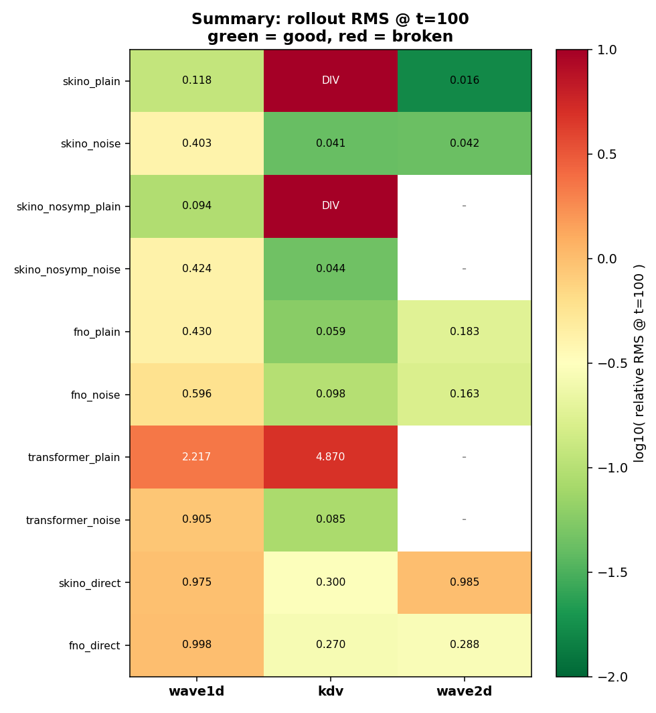

Rollout RMS at t = 100 for every configuration on every problem.
**Green = good, red = broken.** `DIV` = diverged to a non-finite rollout.
Blank cells = not applicable (the no-symplectic and transformer baselines are
1-D only).

**What to take from it**
* The single best cell in the study is **`skino_plain` on wave2d (0.016)** —
  dark green.
* `skino_plain` and `skino_nosymp_plain` are **DIV** on KdV: excellent on the
  linear problems, catastrophic on the nonlinear one without noise.
* The `*_direct` row is uniformly poor (0.27 – 0.99) → the non-recursive
  approach is the weakest strategy tested.
* Reading across a row shows how **problem-dependent** each recipe is: noise is
  a rescue on KdV and a penalty on both wave problems.

---

## 2. RMS vs rollout time — all three problems

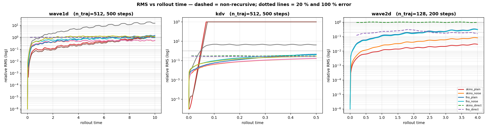

Log-scale error growth. Solid = recursive, dashed = non-recursive.

**wave1d (left)** — every recursive model degrades steadily. `skino_plain` (red)
and `skino_nosymp_plain` (brown) are the lowest curves for most of the horizon.
The noise variants (orange, pink) sit *flat but high* — a plateau that §4 shows
is amplitude collapse, not stability.

**kdv (middle)** — the dramatic panel. `skino_plain` and `skino_nosymp_plain`
track near-perfectly then **shoot vertically off the top** (divergence at steps
86 / 91). The noise variants (orange, pink) stay low and flat — genuinely the
best models here. Note the two families cross over: the models that are *best*
early are the ones that *explode* later.

**wave2d (right)** — `skino_plain` (red) is far below everything else for the
whole rollout; the FNO curves sit an order of magnitude above.

---

## 3. Per-problem RMS detail (linear + log pairs)

Each run also emits a two-panel view: linear scale (usable range) and log scale
(reveals divergence).

### 3.1 wave1d
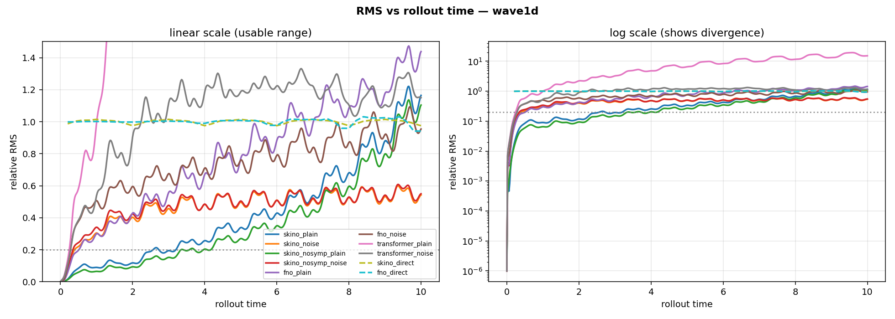

### 3.2 kdv
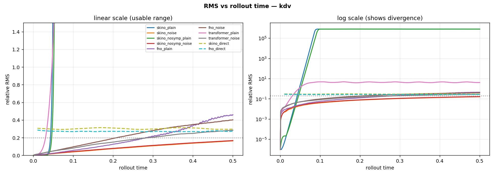

The linear panel is dominated by the divergence; the log panel is the
informative one.

### 3.3 wave2d
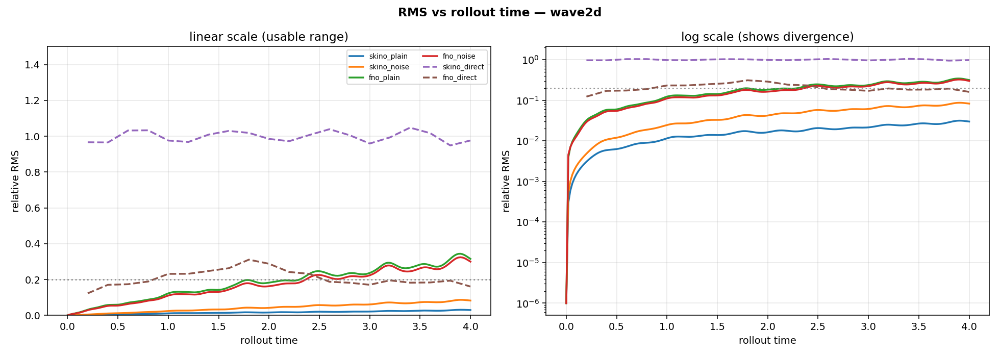

---

## 4. Predicted vs real snapshots — the figures that changed the conclusions

These are the most important plots in the study. **Row 1 is always the ground
truth**; each subsequent row is one model; columns are rollout checkpoints.
In 1-D: black/grey = truth, red = prediction.

### 4.1 kdv

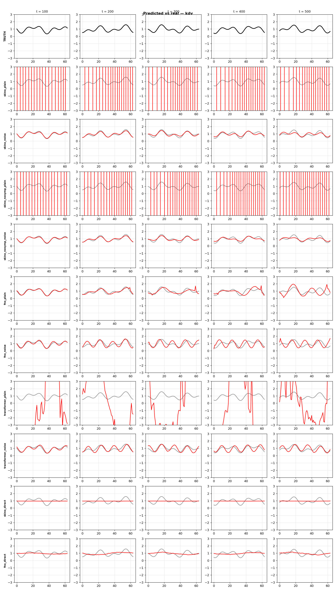

* `skino_noise`, `skino_nosymp_noise` — red overlays grey almost exactly at
  every checkpoint. **Genuine success.**
* `skino_plain`, `skino_nosymp_plain` — violent **grid-scale sawtooth** filling
  ±3. This is what "diverged" looks like: a numerical instability at the Nyquist
  wavelength, not a gradual loss of accuracy.
* `fno_plain` / `fno_noise` — correct amplitude, but the waveform slides out of
  phase as the rollout proceeds.
* `transformer_plain` — off-scale garbage.
* **`skino_direct` / `fno_direct` — a flat line at the mean.** No spatial
  structure whatsoever. Their RMS of 0.27 – 0.30 *looked* like the most stable
  result in the table; the snapshot proves it is a degenerate constant
  predictor.

### 4.2 wave1d

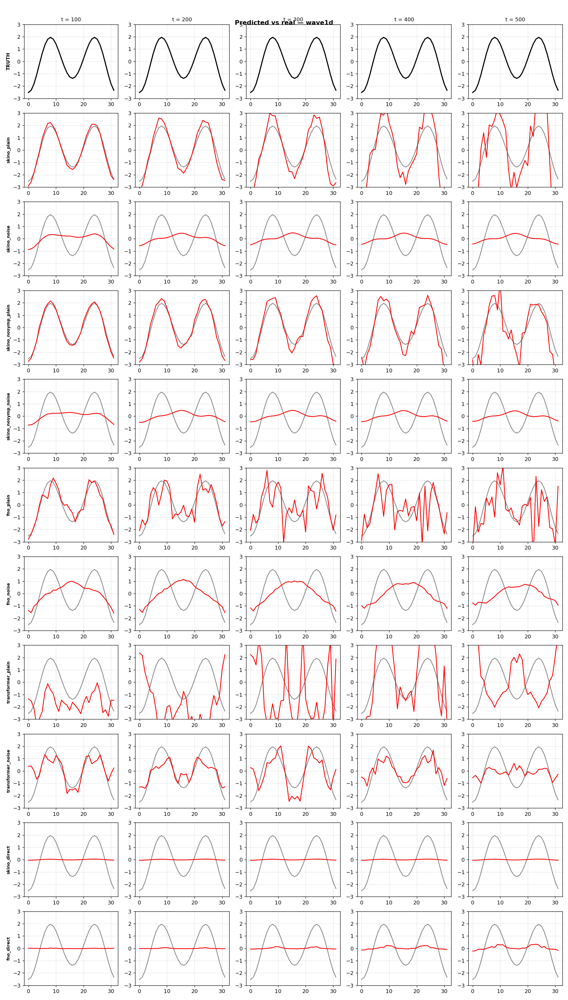

* `skino_plain`, `skino_nosymp_plain` — genuinely track the travelling wave;
  high-frequency contamination accumulates after t ≈ 300.
* **`skino_noise`, `skino_nosymp_noise` — amplitude collapsed to ≈ ±0.4 against
  a true ±2.** Their flat 0.54 RMS is *over-damping*, not stability. This is the
  clearest example of a benign-looking metric hiding a broken model.
* `fno_noise` — partial collapse (±1 vs ±2).
* **`skino_direct` / `fno_direct` — a flat line at zero.**

### 4.3 wave2d

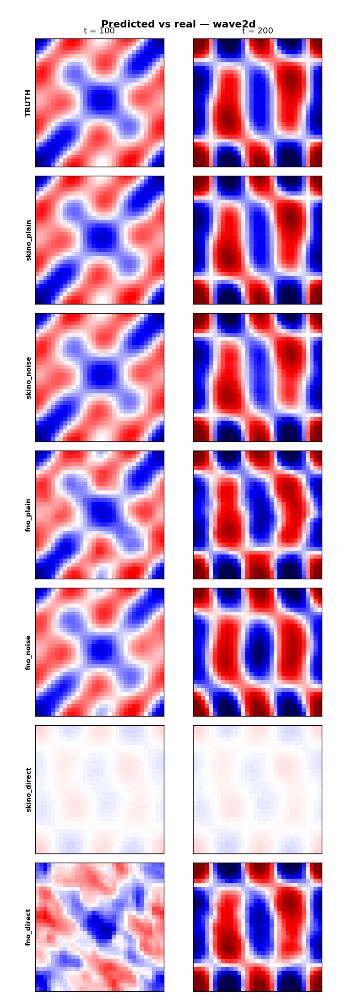

2-D fields shown as heatmaps (red/blue = ±displacement).

* **`skino_plain` is visually indistinguishable from the truth** at both t = 100
  and t = 200 — node lines, interference fringes and amplitudes all reproduced.
  This is the strongest visual result in the study, and it validates the 0.016 /
  0.030 RMS as honest.
* `skino_noise` — very close, slightly smoothed (mild over-damping again).
* `fno_plain` / `fno_noise` — the gross pattern survives but fine structure is
  blurred and distorted.
* **`skino_direct` — nearly blank.** Amplitude collapsed to ≈ 0.
* `fno_direct` — wrong at t = 100 (diagonal artefacts), surprisingly reasonable
  at t = 200; erratic rather than uniformly degenerate.

---

## 5. Grid-level field comparison — actual vs predicted

The snapshots above sample a few instants. These figures compare the **full
field on the computational grid**, including the complete space-time evolution
and the error at every grid point. Produced by
[`compare_fields.py`](compare_fields.py) on four representative configurations
trained with identical hyperparameters to the reported models.

> **Note on the numbers here:** these figures show **one test trajectory**
> (sample 0), whereas the tables in `REPORT_V2.md` average over 16 test
> trajectories. Per-panel values therefore differ slightly from the report
> (e.g. 2-D `skino_plain` at t=200: 0.039 here vs 0.030 averaged).

### 5.1 Space-time evolution — KdV

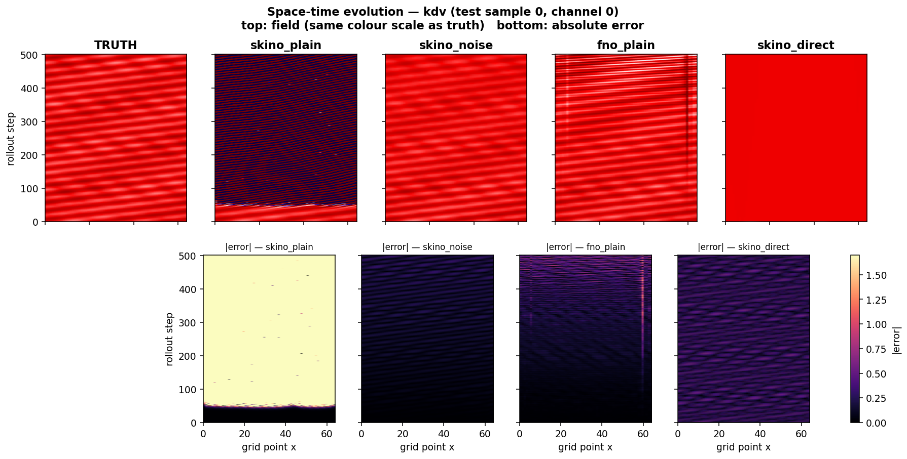

x horizontal, **rollout step vertical** (0 at the bottom, 500 at the top). Top
row = the field on the truth colour scale; bottom row = absolute error.

This single figure contains the entire KdV story:

* **TRUTH** — clean diagonal stripes: solitons propagating steadily to the right.
* **`skino_plain`** — reproduces the stripes for roughly the first 50 steps, then
  the panel goes dark: the solution has left the colour scale entirely. The error
  map below is black up to a sharp horizontal boundary and then **uniformly
  saturated** — you can literally read the divergence step off the figure.
* **`skino_noise`** — diagonal stripes maintained for the **full 500 steps**, and
  the error map is almost entirely black. This is what a working rollout looks
  like.
* **`fno_plain`** — the stripe pattern survives but degrades progressively, with
  a persistent bright vertical band near x ≈ 60: a *localised* error that grows
  in place rather than uniform decay.
* **`skino_direct`** — **uniform red, no structure at all.** The non-recursive
  model outputs an essentially constant field at every time. Its error map shows
  the full truth pattern, because the error *is* the entire signal.

### 5.2 Space-time evolution — wave1d

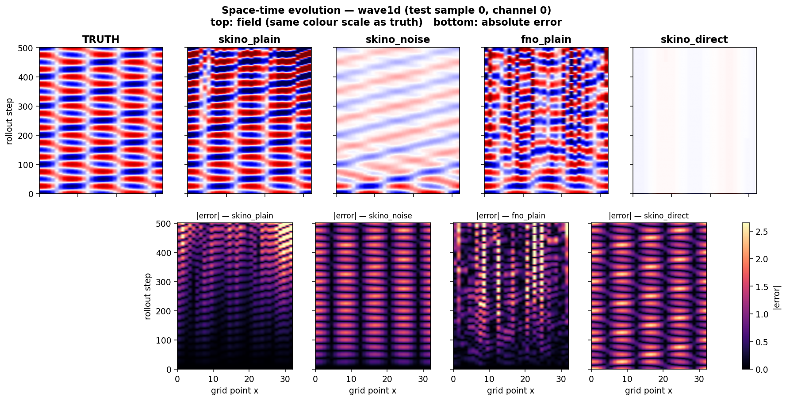

Same layout for the linear wave. Note how the error accumulates gradually and
symmetrically here rather than exploding, and how the noise-trained variant
shows a visibly *fainter* field than the truth — the amplitude collapse
described in §4.2, now visible across the whole rollout at once.

### 5.3 All models overlaid on the truth

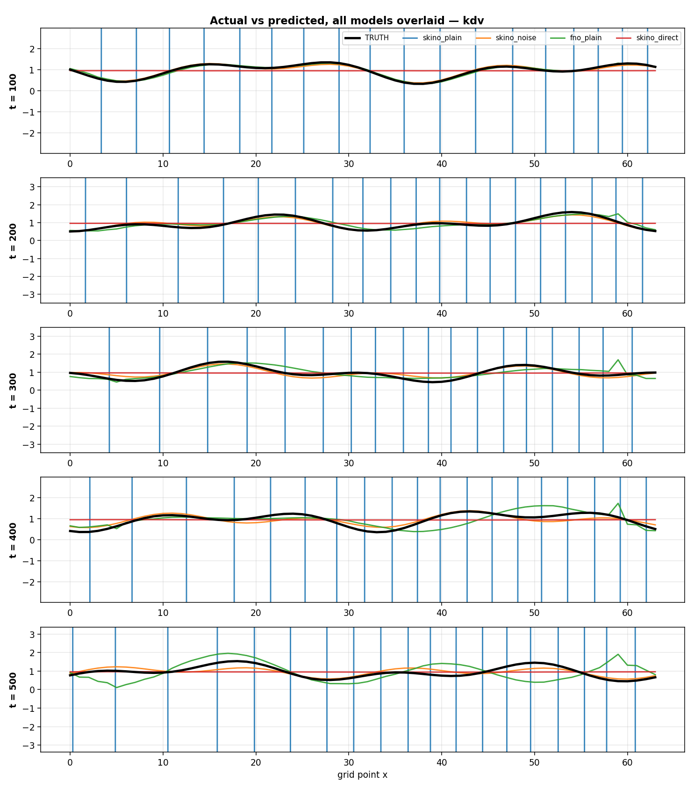

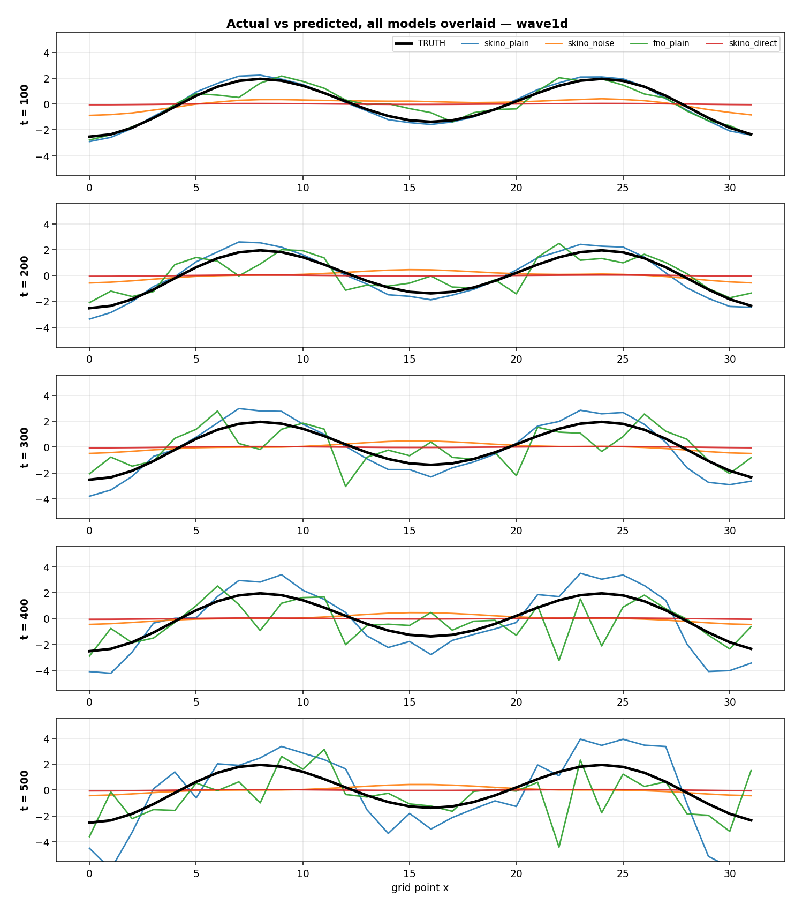

One panel per checkpoint, **truth in thick black** with every model drawn over
it. This is the most direct like-for-like read: where a coloured curve sits on
the black one the model is right, where it flattens toward the axis it is
under-predicting, and where it oscillates wildly it has gone unstable.

### 5.4 Signed error per grid point

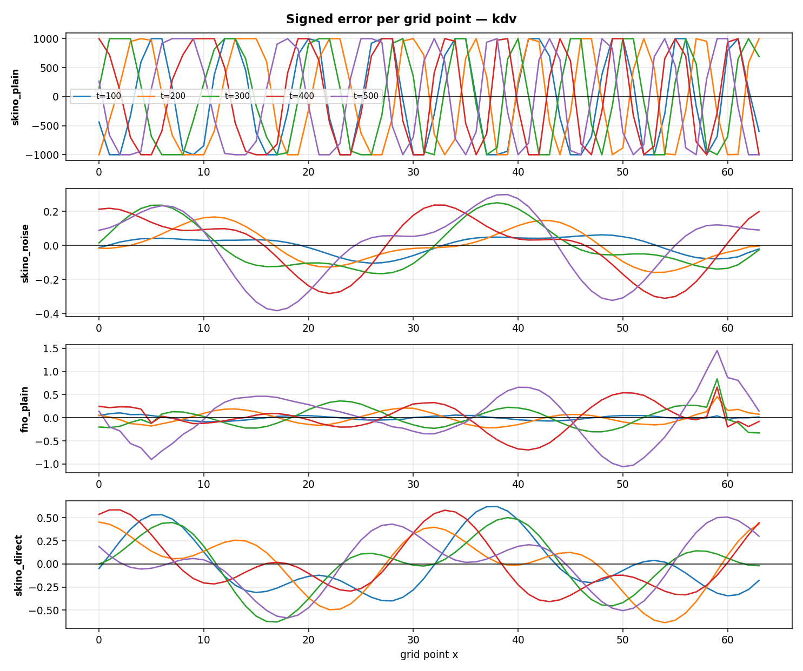

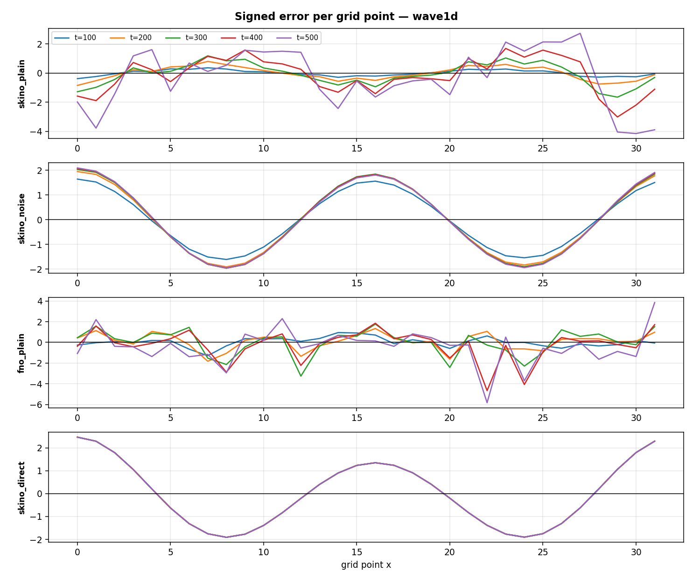

Prediction minus truth at every grid point, one row per model, one colour per
checkpoint. The **shape** of the residual identifies the failure mechanism:

* an error that mirrors the solution shape → **amplitude** error (under/over-prediction);
* an error resembling the spatial derivative → **phase** error (the wave is in the
  right form but the wrong place);
* a rapid point-to-point zig-zag → **grid-scale numerical instability**.

### 5.5 2-D truth | prediction | error

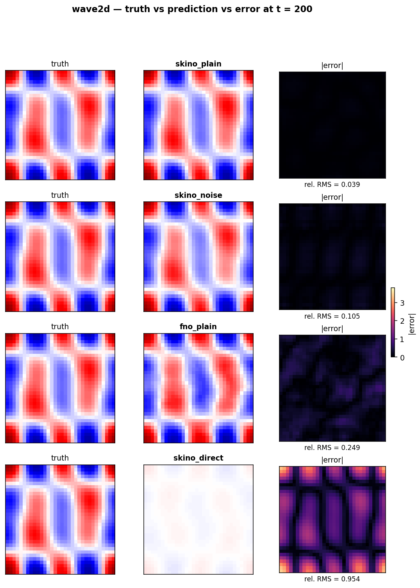

(Companion figure at t = 100:
[`fig_triptych_wave2d_t100.png`](results_v2/fig_triptych_wave2d_t100.png))

Each row is one model: **truth**, its **prediction**, and the **absolute error**
on a shared scale, with the per-panel relative RMS printed underneath.

* **`skino_plain`** — the prediction is visually identical to the truth and the
  error panel is essentially **pure black** (rel. RMS 0.039). With 25 k
  parameters.
* `skino_noise` — very close, with faint residual structure (0.105).
* `fno_plain` — the lobes are visibly smeared and merged; the error panel shows
  clear organised structure (0.249) — at **2.1 M parameters**, 83× more than
  SKINO.
* **`skino_direct`** — the prediction panel is **blank white**: it output
  approximately zero. The error panel is a perfect copy of the truth pattern,
  which is the unmistakable signature of a model that predicts nothing
  (rel. RMS 0.954).

---

## 6. Parameter efficiency — the commercial argument

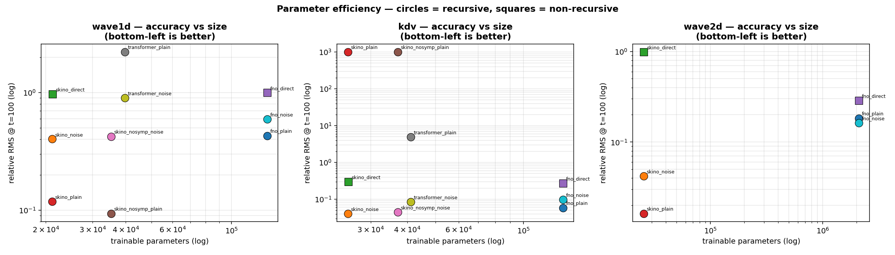

Accuracy (y, log) against model size (x, log). **Bottom-left is better:** fewer
parameters *and* lower error. Circles = recursive, squares = non-recursive.

* On **wave1d** and **kdv**, the SKINO family occupies the bottom-left; FNO sits
  far to the right (136 k parameters) without an accuracy payoff.
* On **wave2d** the gap is extreme — SKINO at 2.5 × 10⁴ parameters and RMS
  0.016, FNO2D at 2.1 × 10⁶ parameters and RMS 0.183.

| wave2d | SKINO | FNO2D |
|---|---:|---:|
| parameters | 25,414 | 2,102,594 (**83×**) |
| RMS @ t=100 | 0.016 | 0.183 (**11× worse**) |

The advantage **grows with dimension** (≈6× in 1-D → 83× in 2-D) because FNO's
spectral weights scale as (modes)^d while SKINO's separable Chebyshev kernel
scales linearly in the number of axes. Since the target problem is 3-D, this
trend is the most practically relevant result of the programme.

---

## 7. One-step accuracy does not predict rollout quality

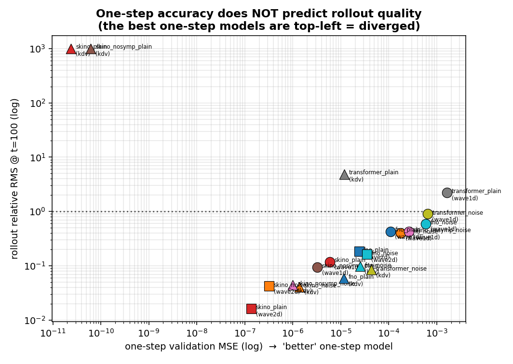

x = one-step validation MSE (further left = "better" by the conventional
metric); y = actual rollout RMS at t = 100.

If one-step loss were a good selection criterion, points would fall on a rising
diagonal. They do not:

* The two points with the **best one-step MSE in the entire study**
  (≈2 × 10⁻¹¹ and 6 × 10⁻¹¹, far left) sit at the **top** — they diverged.
* The best rollout model (`skino_plain` on wave2d, bottom) has a one-step MSE
  four orders of magnitude *worse* than those diverging models.

**Consequence:** one-step validation loss must not be used for model selection
or early stopping in this project. Rollout evaluation is mandatory.

---

## 8. Checkpoint bar chart

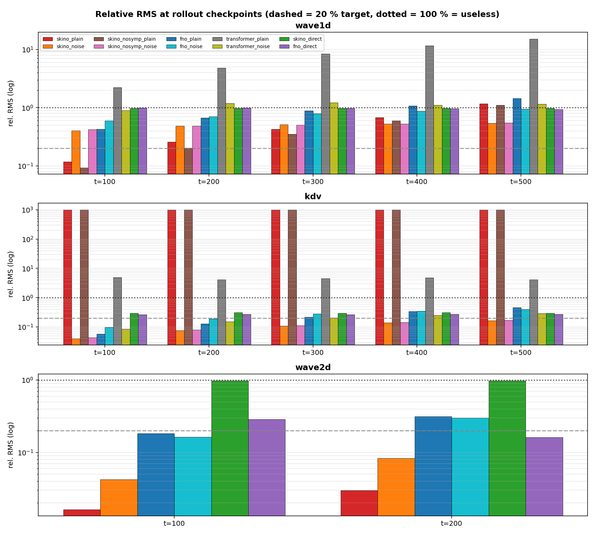

Relative RMS at t = 100 … 500 grouped by checkpoint (log y). Dashed line = 20 %
target, dotted = 100 % (useless).

Shows **error-growth rate**, which the summary heatmap hides:
* On kdv, `skino_noise` rises gently (0.041 → 0.165 over 500 steps) whereas
  `fno_plain` rises steeply (0.059 → 0.462) — they start comparable but SKINO
  degrades ~3× more slowly.
* The `*_direct` bars are **flat across checkpoints** — the signature of a
  horizon-independent constant predictor rather than a model that tracks
  dynamics.

---

## 9. Appendix — earlier calibration figures (v1 study)

Context for why `noise = 0.02` was chosen and why the energy penalty was dropped.

### 9.1 wave1d recipe ablation
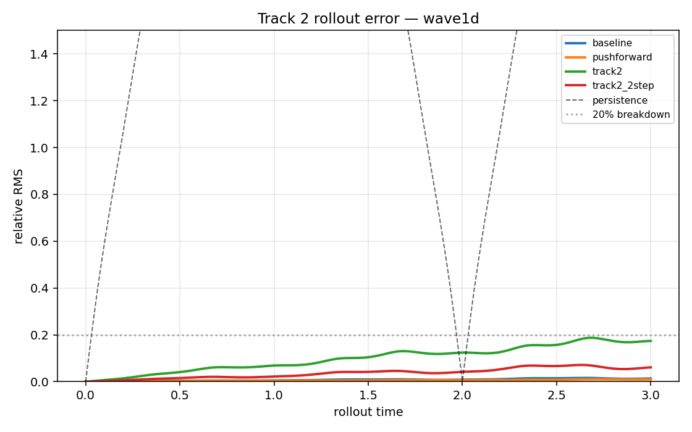

`baseline` (one-step only) vs `pushforward` (K-curriculum) vs `track2`
(+noise+energy) vs `track2_2step` (+two-step stencil), with a **persistence**
reference (freeze the initial state). The V-shape of the persistence curve is a
wave-**recurrence** artefact: the solution returns near its initial state at
≈100 steps, so "beats persistence" is not meaningful on this problem.

### 9.2 kdv recipe ablation
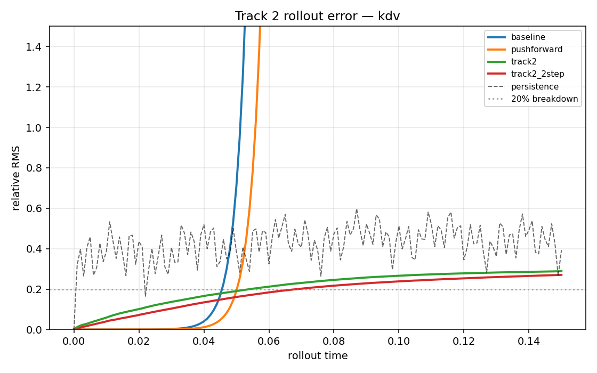

The un-stabilised curves go vertical; the noise-stabilised ones plateau.

### 9.3 kdv noise calibration
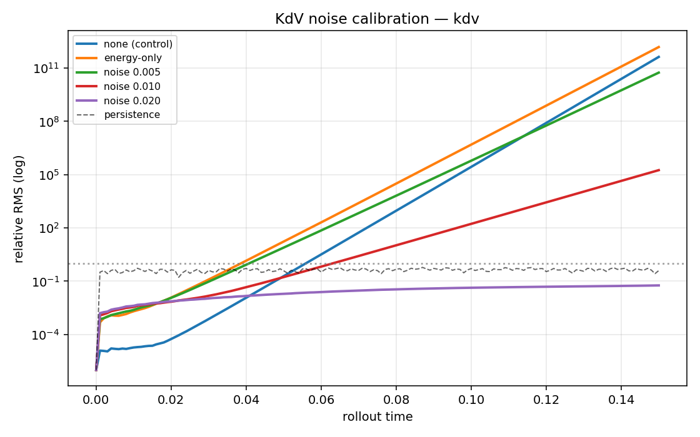

Noise sweep on a log axis, isolating the stabiliser:
`energy-only` (no noise) diverges to 10¹² — **worse than no stabiliser at all**,
which is why the energy penalty was dropped. RMS falls monotonically as noise
rises (0 → 0.005 → 0.010 → 0.020) and only **0.02** yields a bounded rollout.

---

## 10. Figure index

| File | Content |
|---|---|
| [`fig_heatmap.png`](results_v2/fig_heatmap.png) | Summary — RMS @ t=100, all configs × all problems |
| [`fig_rms_all.png`](results_v2/fig_rms_all.png) | RMS vs rollout time, three problems side by side |
| [`fig_param_efficiency.png`](results_v2/fig_param_efficiency.png) | Accuracy vs parameter count |
| [`fig_val_vs_rollout.png`](results_v2/fig_val_vs_rollout.png) | One-step MSE vs rollout RMS (anti-correlation) |
| [`fig_checkpoint_bars.png`](results_v2/fig_checkpoint_bars.png) | RMS at t=100…500, grouped bars |
| [`snapshots_wave1d.png`](results_v2/snapshots_wave1d.png) | Predicted vs real fields, wave1d |
| [`snapshots_kdv.png`](results_v2/snapshots_kdv.png) | Predicted vs real fields, KdV |
| [`snapshots_wave2d.png`](results_v2/snapshots_wave2d.png) | Predicted vs real fields, 2-D wave |
| [`fig_spacetime_kdv.png`](results_v2/fig_spacetime_kdv.png) | **Grid-level** space-time (x,t) maps + error, KdV |
| [`fig_spacetime_wave1d.png`](results_v2/fig_spacetime_wave1d.png) | **Grid-level** space-time (x,t) maps + error, wave1d |
| [`fig_overlay_kdv.png`](results_v2/fig_overlay_kdv.png) | All models overlaid on truth per checkpoint, KdV |
| [`fig_overlay_wave1d.png`](results_v2/fig_overlay_wave1d.png) | All models overlaid on truth per checkpoint, wave1d |
| [`fig_errorgrid_kdv.png`](results_v2/fig_errorgrid_kdv.png) | Signed error per grid point, KdV |
| [`fig_errorgrid_wave1d.png`](results_v2/fig_errorgrid_wave1d.png) | Signed error per grid point, wave1d |
| [`fig_triptych_wave2d_t100.png`](results_v2/fig_triptych_wave2d_t100.png) | 2-D truth \| prediction \| error at t=100 |
| [`fig_triptych_wave2d_t200.png`](results_v2/fig_triptych_wave2d_t200.png) | 2-D truth \| prediction \| error at t=200 |
| [`rms_wave1d.png`](results_v2/rms_wave1d.png) | wave1d RMS, linear + log |
| [`rms_kdv.png`](results_v2/rms_kdv.png) | KdV RMS, linear + log |
| [`rms_wave2d.png`](results_v2/rms_wave2d.png) | wave2d RMS, linear + log |
| [`ablation_wave1d.png`](results/ablation_wave1d.png) | v1 recipe ablation, wave1d |
| [`ablation_kdv.png`](results/ablation_kdv.png) | v1 recipe ablation, KdV |
| [`calibrate_kdv.png`](results/calibrate_kdv.png) | v1 noise calibration sweep |

Regenerate the analysis figures at any time with:

```powershell
$env:KMP_DUPLICATE_LIB_OK = "TRUE"
python -m track2.make_figures                              # metric figures (from JSON)
python -m track2.compare_fields --problem kdv --plot-only  # grid-level (from cache)
```

The grid-level figures use cached model weights and predicted trajectories under
`results_v2/cache/`, so `--plot-only` regenerates them in seconds. Omit
`--plot-only` to retrain from scratch.

---

## 11. What the pictures say, in one paragraph

The snapshots (§4) and the grid-level field comparisons (§5) are the
load-bearing evidence. They show that three configurations with calm, flat RMS
curves are actually degenerate — two forms of "predict almost nothing"
(amplitude collapse and constant-field prediction) — while the models that
*look* worse in the table are the ones genuinely tracking the physics. The KdV
space-time map (§5.1) shows the divergence step directly, and the 2-D triptych
(§5.5) shows the one unambiguous success: SKINO reproducing the 2-D wavefield
with an essentially black error panel at 83× fewer parameters than FNO, next to
a non-recursive model whose error panel is an exact copy of the signal it failed
to predict. **Any future rollout metric in this project should be published next
to its field comparison.**
